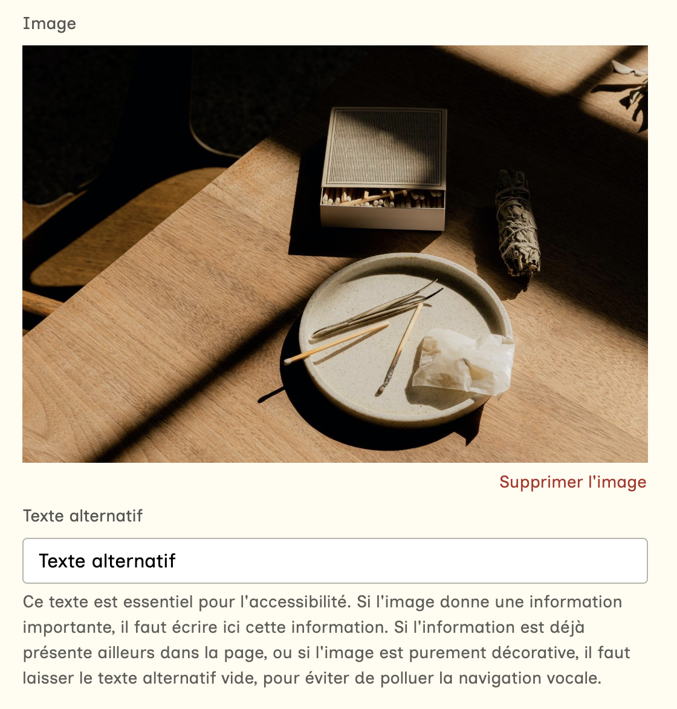

Le choix d'une image à la une se fait via une app Vue nommé `FeaturedImageApp`, qui agrège :
- un composant [Choix de média](/docs/admin/composants/media-input/)
- une gestion de la description alternative
- un bouton d'enregistrement `Changes`

Les données stockées sont :
- `featured_media_id`, l'identifiant du média
- `featured_media_alt`, la description alternative

La description alternative est d'abord recopiée depuis le média, mais peut-être modifiée contextuellement.
Il n'y a pas de mise à jour a posteriori si on modifie l'alt du média.
