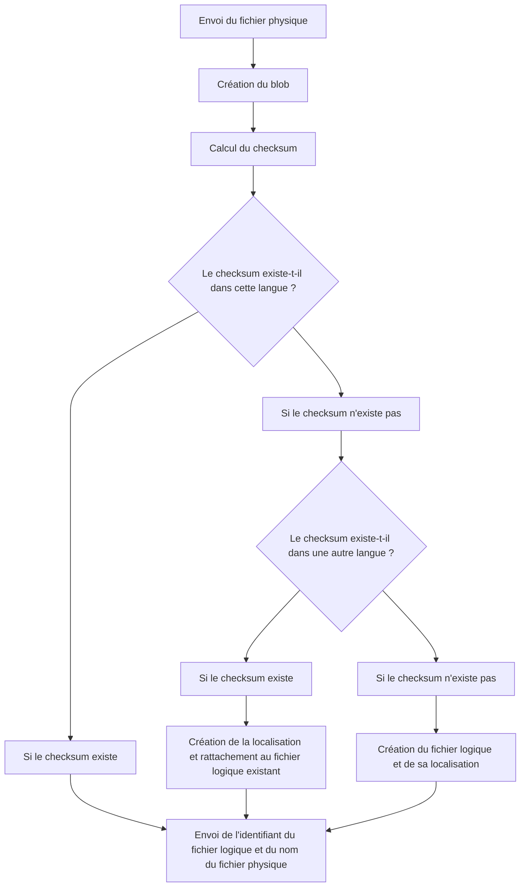
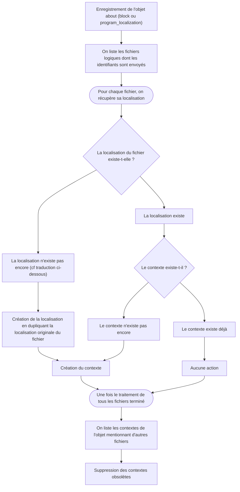
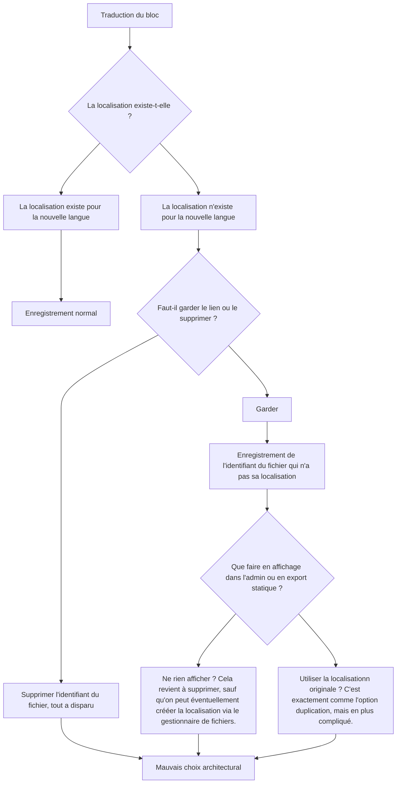
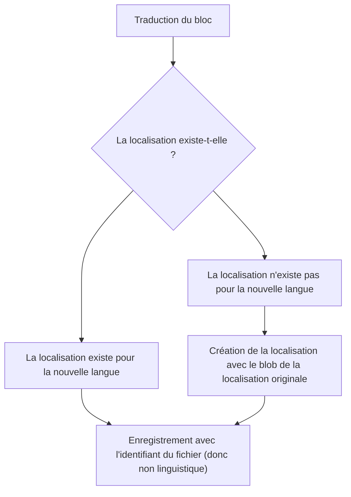
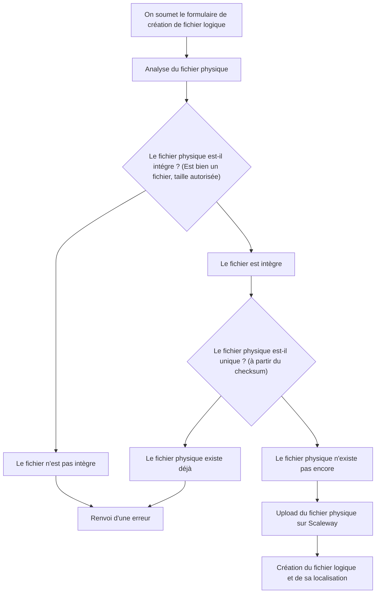
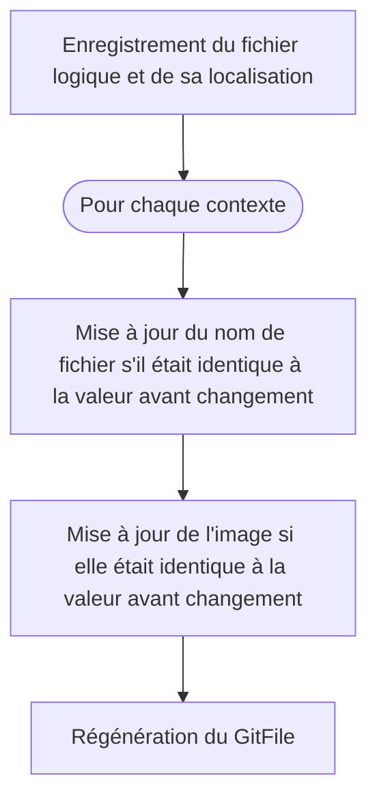

## Introduction

https://roadmap.osuny.org/fonctionnalites/2026-espace-de-gestion-des-fichiers/

Le gestionnaire de fichiers a pour but de faciliter la gestion de l'ensemble des fichiers envoyés dans une instance.
La plupart des fichiers viennent des blocs, mais il y a aussi les fichiers liés directement aux formations.

L'intérêt est multiple : 
- éviter les doublons
- permettre la mise à jour centralisée
- fournir une base propre de fichiers aux équipes qui les utilisent
- faciliter la recherche dans cette base avec des critères multiples

## Principes

### Glossaire

| Nom | Définition |
|--|--|
| fichier physique | l'ensemble de données binaires que l'on upload ou download |
| blob | l'enregistrement dans la table `active_storage_blobs` |
| fichier logique | l'enregistrement dans la table `communication_files` |
| localisation | l'enregistrement dans la table `communication_file_localizations` |
| contextes | les cas d'usage d'une localisation |

### Ergonomie

L'envoi d'un fichier physique à la place d'un autre dans un bloc pose un problème ergonomique.

Il y a 2 possibilités : 
- soit la personne veut mettre à jour le fichier physique précédent, donc le remplacer
- soit la personne envoie un nouveau fichier, qui n'a pas de rapport avec le précédent

Pour résoudre simplement les choses, on ne peut mettre à jour que via la bibliothèque de fichiers.
Dans les blocs, tout ce qu'on envoie est considéré comme nouveau.

## Via les blocs

### Direct upload

Ce cas se passe lors de l'envoi via un bloc Fichiers.

À cette étape : 
1. le fichier physique existe sur Scaleway
2. le fichier logique existe dans la base de données avec sa localisation
3. mais le bloc n'a pas été enregistré

### Enregistrement d'un `about`

Lors de l'enregistrement du bloc (ou de la formation), on entre dans un autre flux.

### Traduction

Cela se passe parce que l'on traduit l'objet lié (la page dans laquelle est le bloc, par exemple).

Il y a 2 options pour le traitement, mais l'une des 2 est mauvaise.
Les 2 sont documentées ci-dessous.

Mauvaise option : absence de localisation


Cette option créée des complications architecturales et ergonomiques.


Bonne option : duplication du fichier original

### Suppression

Lors de la suppression d'un bloc, d'une formation ou autre, il faut détruire les contextes dont l'objet est l'about.
Comme c'est une propriété polymorphe, il faut passer par un before_destroy.

## Via la bibliothèque de fichiers

### Création

À cette étape : 
1. le fichier physique existe sur Scaleway
2. le fichier logique existe dans la base de données avec sa localisation

### Modification

Il s'agit là de mettre à jour le fichier physique, ou les propriétés de la localisation (nom, catégories, description interne, image).
Tout le début est identique à l'enregistrement, on reprend à la dernière étape.

### Suppression

On ne peut supprimer que les fichiers sans contexte.

### Fusion

Il y aura, tôt ou tard, le besoin de fusionner des fichiers qui sont en fait des versions locales l'un de l'autre.

