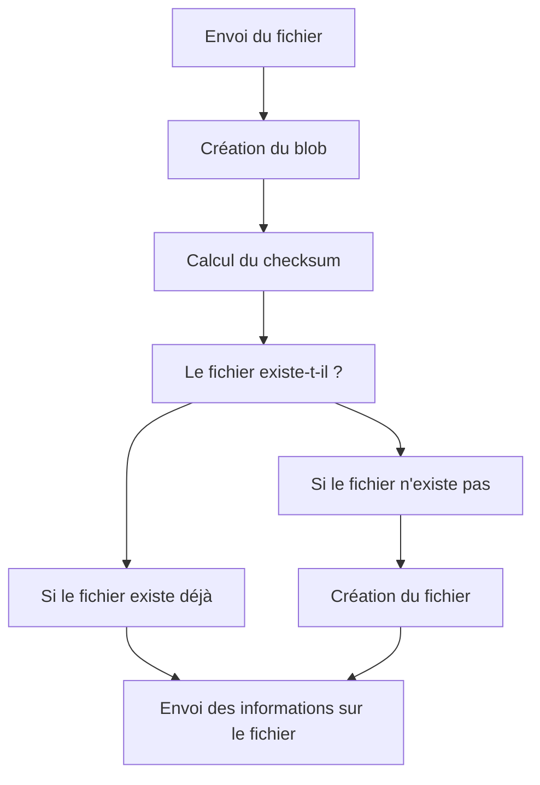
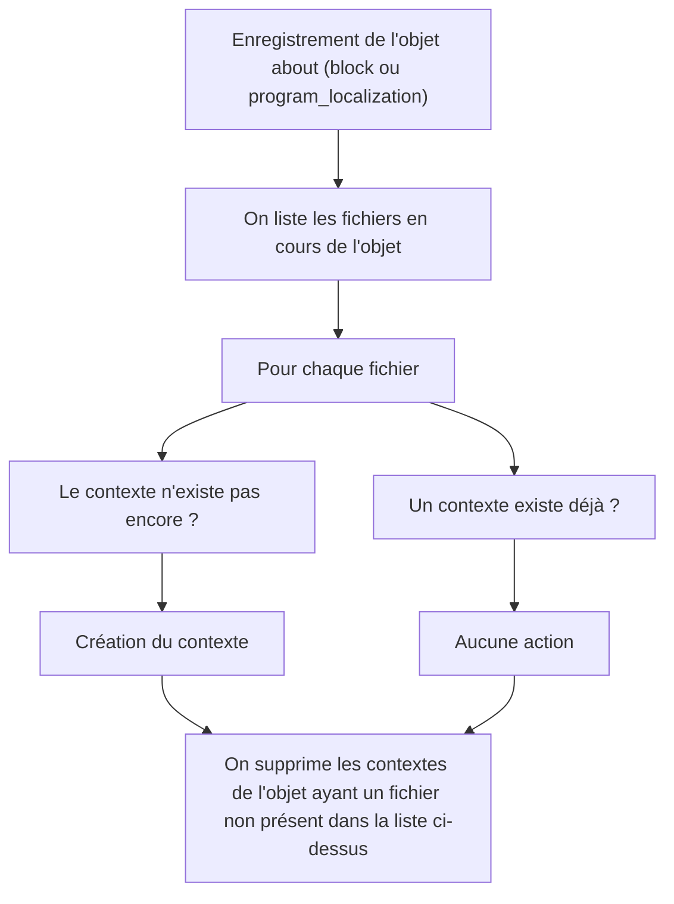

https://roadmap.osuny.org/fonctionnalites/2026-espace-de-gestion-des-fichiers/

Le gestionnaire de fichiers a pour but de faciliter la gestion de l'ensemble des fichiers envoyés dans une instance.
La plupart des fichiers viennent des blocs, mais il y a aussi les fichiers liés directement aux formations.

L'intérêt est multiple : 
- éviter les doublons
- permettre la mise à jour centralisée
- fournir une base propre de fichiers aux équipes qui les utilisent

## Upload

À cette étape, le fichier physique est sur Scaleway, le fichier est créé, mais le bloc n'a pas été enregistré.
Lors de l'enregistrement, on entre dans un autre flux.

