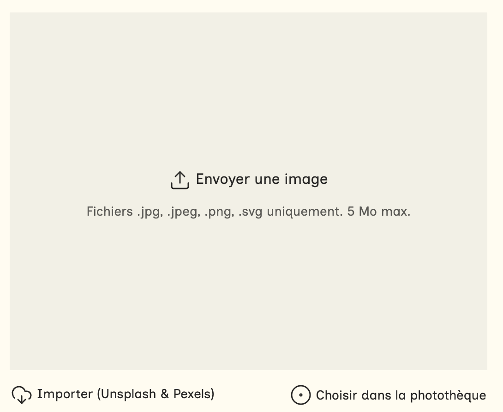

Le choix de media est un composant qui gère les 3 sources possibles de médias : 
- l'envoi direct
- le choix Unsplash / Pexels
- le choix dans la photothèque

Les 3 choix aboutissent au même résultat : un identifiant de média.
