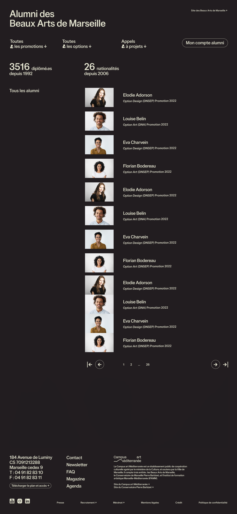

Cette nouvelle fonctionnalité est codée pour les Beaux Arts de Marseille.

## Périmètre fonctionnel

### Page d'accueil

Dans le menu :
- une liste des années
- une liste des formations (options ici)

Dans la page :
- des métriques (nombre d'alumni, nombre de nationalités)
- les premiers alumni par ordre alphabétique

### Page d'une personne

Atypique : formation, promotion et diplôme sous forme de tags cliquables.
Dans le thème, on peut probablement plutôt faire un tableau, plus robuste s'il y a plusieurs formations.
Il faut peut-être utiliser le tableau aussi pour ça, parce que le cursus complet implique 2 promos et 2 diplômes, donc 5 tags.

> [!WARNING]
> Les backlinks sont dans un autre site !

## Architecture

Plusieurs architectures possibles :
1. Extranet en mode public
2. Nouvelle fonctionnalité au niveau du site Web
3. Type particulier de site Web
4. Sous-partie spécifique d'un site

### 1. Extranet en mode public

Avantages :
- ça permet de faire ce que l'on veut en fonctionnel

Inconvénients :
- charge serveur
- maintenance CSS
- nouvelle porte d'entrée "publique" dans Osuny

### 2. Nouvelle fonctionnalité au niveau du site Web

Fonctionnalité uniquement activable pour les sites d'écoles et de formations, s'il y a des alumni.

Avantages :
- se greffe sur n'importe quel site
- maintenance CSS facile
- les objets des backlinks des personnes sont directement dans le site

Inconvénients :
- pb pour gérer la home et les menus spécifiques en automatique

### 3. Type particulier de site Web

Avantages :
- permet de gérer spécifiquement certains fonctionnalités comme le menu ou la page d'accueil
- maintenance CSS facile

Inconvénients :
- les objets des backlinks des personnes viennent d'un autre site (question de fédération de contenu)
- les sites sont définis par leur about, il n'y a pas réellement de type

### 4. Sous-partie spécifique du site des Beaux-Arts

C'est une sous-option de l'option 2.

Avantages :
- Simple pour les backlinks

Inconvénients :
- URLs confuses
- 2 menu et 2 CSS en fonction

### Choix : fonctionnalité conditionnelle

On reste sur le choix de fonctionnalités, mais on conditionne à l'about : soit une école, soit une formation.

## Implémentation

### Admin

#### Fonctionnalité

Ajout de la fonctionnalité.
Mention de la fonctionnalité quelque part dans les fichiers statiques.

#### Dépendance des alumnis

A déclarer via les dépendances de formation, via les promotions. N'était pas en place car jusque là spécifique aux extranets.

#### Export des personnes

Git files pour les personnes. Pas d'url spécifique, url normale de personne.
Il faut ajouter des infos sur les promotions

> [!WARNING]
> Comment générer les connexions ? Le processus de connexion des dépendances du about du site n'est pas clair.

#### Backlinks fédérés

Prendre les backlinks d'une personne à partir de contenus fédérés d'un autre site.

#### Export des promotions

En section ou en taxonomie ?

#### Export des années

En taxonomie ?

### Thème

#### Menu spécifique

Lister les promos et les formations (parcours, mentions, options...).

#### Home

- lister les n premiers alumni
- remonter les métriques (nombre d'alumni depuis, nombre de nationalités via taxonomie)

#### Personne

L'alumni n'a pas de page spécifique, c'est la personne directement.

| Propriété | Valeur |
| - | - |
| permalink | /fr/persons/:slug/ |
| | /fr/persons/pierre-andre-boissinot/ |
| file | /content/fr/persons/:slug.html |
| | /content/fr/persons/pierre-andre-boissinot.html |
| path | /persons/:slug |
| | /persons/pierre-andre-boissinot |

#### Année académique

Une année rassemble 1 ou plusieurs cohortes.

| Propriété | Valeur |
| - | - |
| permalink | /fr/alumni/YYYY/ |
| | /fr/alumni/2025/ |
| file | /content/fr/academic_years/YYYY/_index.html |
| | /content/fr/academic_years/2025/_index.html |
| path | /academic_years/YYYY |
| | /academic_years/2025 |

#### Cohorte

Une cohorte regroupe une formation (avec son possible diplôme) et une année.

| Propriété | Valeur |
| - | - |
| permalink | /fr/alumni/:cohort_year/:program_slug/ |
| | /fr/alumni/2025/metiers-du-multimedia-et-de-l-internet/ |
| file | /content/fr/academic_years/YYYY/:program_slug.html |
| | /content/fr/academic_years/2025/metiers-du-multimedia-et-de-l-internet.html |
| path | /academic_years/YYYY/:program_slug |
| | /academic_years/2025/metiers-du-multimedia-et-de-l-internet |

