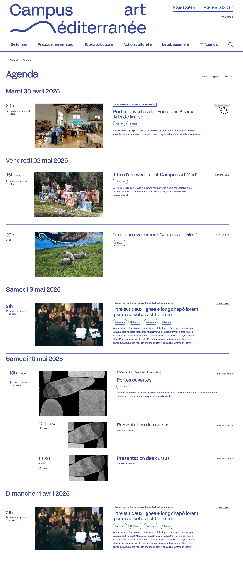
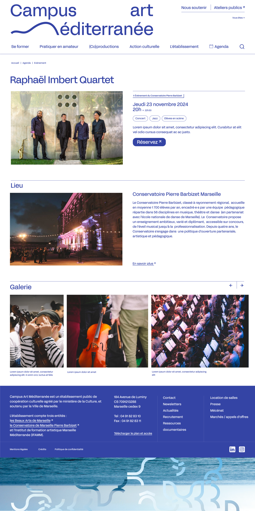

La fédération est la capacité à utiliser des contenus d'un site dans un autre site.
Nous la développons pour le Campus art Méditerranée, qui souhaite présenter dans le site du Campus des événements des Beaux-Arts et du Conservatoire.
Cela concerne uniquement les événements, mais il serait bon d'avoir un système générique.

## Fonctionnalités

### Pages

#### Agenda

#### Événement

### En admin

En administration, il faut définir les sites qui donnent du contenu et les sites qui le reçoivent.
En l'occurence, le Conservatoire et les Beaux-Art donnent, le Campus reçoit.

Mais cela pose une question éditoriale. 
Le Campus ne veut pas forcément recevoir tout les contenus des autres sites.
Le Conservatoire et les Beaux-Arts ne veulent pas forcément donner tous leurs contenus.

On pourrait donc imaginer un système dans lequel, pour chaque contenu, on doit choisir de partager du côté de l'émetteur, et accepter de recevoir du côté du récepteur. 
C'est très fin, mais c'est très lourd.

### Dans le thème

Les contenus fédérés se présentent avec un style graphique particulier, indiquant qu'ils appartiennent à un autre site.

Ils se comportent comme des événements natifs, sauf qu'il y a une URL canonique qui est celle de la source.