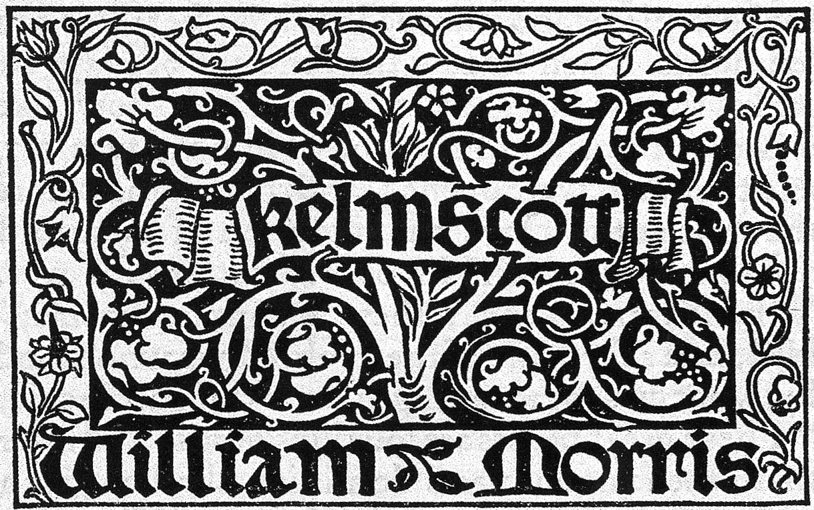

Kelmscott est une imprimerie de sites web. 

C'est une machine qui :
- compile les sites Hugo
- met en ligne les sites compilés
- informe des erreurs
- garde un journal des compilations

## En savoir plus sur le nom

La Kelmscott Press représente l'aboutissement de la carrière de William Morris dans le domaine des arts graphiques, où il peut réaliser d'un bout à l'autre ses aspirations et mettre en application ses principes. Le nom vient du village de Kelmscott, où il a acquis le manoir du même nom. Morris aspire à retrouver le métier des anciens typographes, la prééminence du travail manuel sur la mécanisation et l'industrialisation. Dans un laps de temps relativement court, entre 1891 et 1898 (Morris disparaît en 1896), la Kelmscott Press produit 66 livres, inspirés par les incunables des premières années de l’imprimerie.

[Wikipédia](https://fr.wikipedia.org/wiki/Kelmscott_Press)

## Flux

