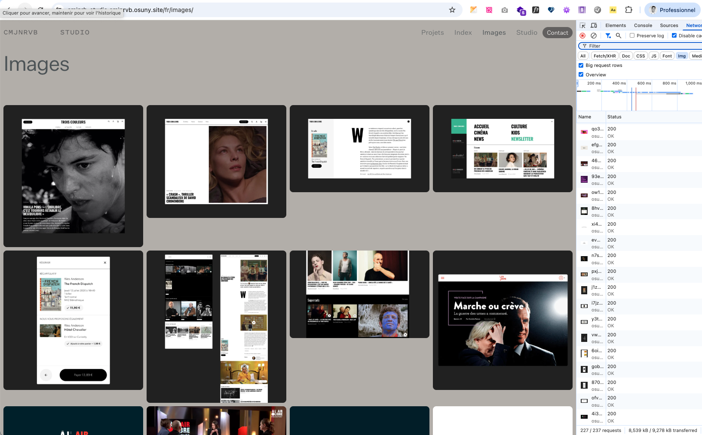

## 1. Quel niveau de contraste minimum ? AA ou AAA ?

Réponse : **AA 4.5:1**

> Le RGAA (WCAG) recommande un rapport de contraste entre le texte et son arrière-plan de 4.5:1. Cela correspond au seuil AA du WCAG.

## 2. Une `img` dans un `button`

Suite à l'audit RGAA 2024 le bouton d'ouverture des lightbox a été déplacé pour englober l'image à ouvrir.

### L'effet de bord inattendu sur l'écoception

Mettre une `img` dans une balise `button` entraîne un  sur les navigateurs qui casse le comportement de chargement progressif (loading=lazy).

Cela est dû à l'usage de la balise button qui englobe l'image. Le navigateur n'interprète plus la hauteur naturelle de l'image et stack les images les une en dessous des autres. L'intersection observer du navigateur croit alors que toutes les images sont dans le viewport et lance les chargements.



#### Le code qui casse

```
<button class="lightbox-button" data-lightbox="">
  <figure>
    
  </figure>
</button>
```

#### Le code qui répare 

```
<div role="button" tabindex="0" class="lightbox-button" data-lightbox="">
  <figure>
    
  </figure>
</div>
```