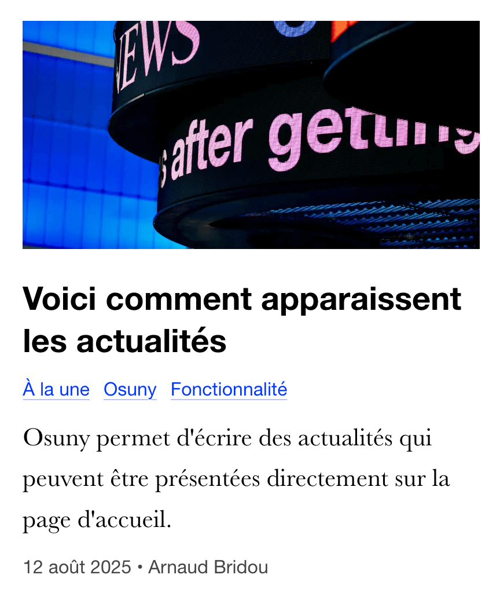
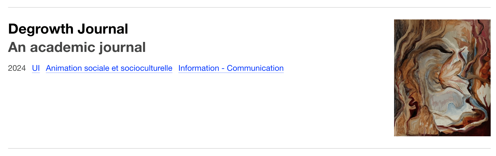

## Problématique

Les designs des blocs sont trop aléatoires.

## Cas concret

Le placement des meta des objets sont très variable.

## Situation idéale

Les mises en page doivent être cohérentes entre les différentes collections.

## Solution proposée

Valider un seul style de séparateur et homogénéiser le sens des éléments.