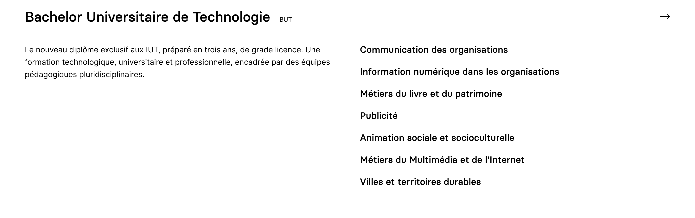
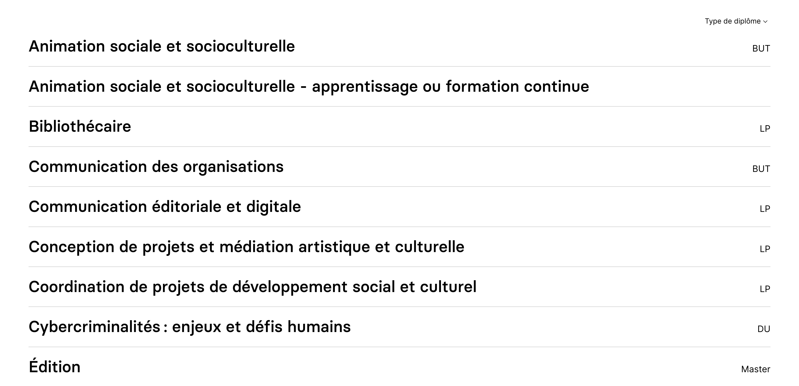
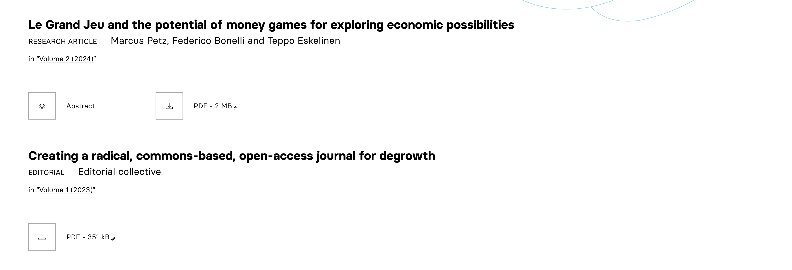
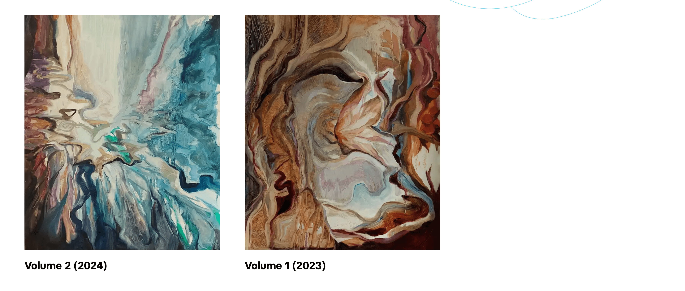

## Situation en avril 2024

Les paramètres d'affichage des différents objets (pages, actualités, événements, personnes...) manquent d'unification.
Certains paramètres sont globaux, pour tout le site, et d'autres sont locaux, au niveau d'un bloc.
Par ailleurs, les paramètres globaux dépendent des contextes : on peut vouloir afficher l'auteur d'un article sur la page de l'article (`single`), mais pas sur la page de liste des articles (`index`).

Une partie se situe dans le fichier de configuration :

```YAML {filename="themes/osuny-hugo-theme-aaa/config.yaml"}
  events:
    default_image: false
    date_format: ":date_long"
    index:
      show_categories: false
      show_author: false
      show_description: true
      truncate_description: 200 # Set to 0 to disable truncate
      layout: list # grid | list
```

Un ajout récent (post) est groupé dans un nœud `options`, avec un doublon (`show`/`hide`).

```YAML {filename="themes/osuny-hugo-theme-aaa/config.yaml"}
  posts:
    default_image: false
    date_format: ":date_long"
    index:
      show_categories: true
      show_author: false
      show_description: true
      truncate_description: 200 # Set to 0 to disable truncate
      layout: list # grid | list
      options:
        hide_image: false
        hide_summary: false
        hide_category: false
        hide_author: false
        hide_date: false
```

Une partie se situe dans les blocs eux-mêmes :

```YAML {filename="content/en/_index.html"}
  - kind: block
    template: pages
    data:
      show_main_description: false
      show_descriptions: true
      show_images: false
      layout: grid
```

Avec [l'ajout récent au bloc actualités](https://github.com/osunyorg/admin/pull/1726), on passe d'une syntaxe `show` à une syntaxe `hide` :

```YAML {filename="content/fr/_index.html"}
  - kind: block
    template: posts
    data:
      mode: selection
      hide_image: false
      hide_summary: false
      hide_category: false
      hide_author: false
      hide_date: false
      layout: large
```

Au niveau de l'admin, la question des `show` vs `hide` est mal traitée, il s'agit en fait d'une question de configuration par défaut. 
Au début du développement d'Osuny, l'idée était de ne rien afficher, et de laisser les personnes ajouter des informations, d'où l'idée du `show`.
Ensuite, pour les options d'affichage des actualités, nous avons travaillé à l'envers : on affiche toutes les informations, et on choisit quoi masquer.
La réalité est que ça dépend des critères, et qu'il faut traiter ça avec des valeurs par défaut pertinentes.

## Situation projetée

### Le nœud `options`

Il faut généraliser l'emploi d'un nœud `options` qui contient toutes les options d'affichage.
Il ne faut ni show ni hide, mais le critère brut.
La valeur `true` indique qu'il faut l'afficher, la valeur `false` qu'il faut le masquer.

```YAML{filename="post"}
options:
  image: true
  summary: true
  category: true
  author: true
  date: true
```

Dans cet exemple, il faut tout afficher.

### La configuration du site

Le fichier de configuration doit utiliser les options par contexte, c'est à dire au moins une fois dans `index` et une fois dans `single`.

```YAML {filename="themes/osuny-hugo-theme-aaa/config.yaml"}
  events:
    default_image: false
    date_format: ":date_long"
    truncate_description: 200 # Set to 0 to disable truncate
    index:
      options: 
        categories: false
        author: false
        description: true
      layout: list # grid | list
    single:
      options: 
        categories: true
        author: true
        description: true
```

Il y a des incohérences à résoudre : 
- `category` ou `categories` ? `categories` est plus juste
- `description` ou `summary` ? `summary` est plus cohérent

Le `layout` n'est pas une option d'affichage, il va déterminer à quel partial on passe les options.
L'image par défaut `default_image` et le format de date `date_format` n'ont pas de raison de changer en fonction des contextes, c'est pour tout le site.
La troncature de description `truncate_description` devrait aussi passer pour tout le site, c'est une logique d'ensemble.

### Les blocs

Il faut utiliser aussi des nœuds options, que l'on peut passer tels quels aux partials, d'où l'importance de les unifier.

```YAML {filename="Bloc pages"}
  - kind: block
    template: pages
    data:
      main_description: false
      options:
        description: true
        image: false
      layout: grid
```

La variable `main_description` est liée au cas particulier de la page principale avec ses enfants, ce n'est pas une option d'affichage normale des pages.
Il faut remettre les valeurs au singulier, parce qu'on va la passer au partial.

```YAML {filename="Bloc posts"}
  - kind: block
    template: posts
    data:
      mode: selection
      options:
        image: false
        summary: false
        category: false
        author: false
        date: false
      layout: large
```

### L'admin

Il faut ajouter la possibilité d'établir des valeurs par défaut, sous la forme de cases à cocher précochées à la création d'un bloc.

On passerait ainsi de 
```ruby{filename="app/models/communication/block/template/post.rb"}
  has_component :hide_image, :boolean
```
à 
```ruby{filename="app/models/communication/block/template/post.rb"}
  has_component :option_image, :boolean, default: true
```
Le préfixe option paraît une solution simple, mais peut-être faut-il structurer davantage en créant un objet `options`.

Cela pose un problème de migration des blocs existants, qu'il faut réaliser en conservant les choix des personnes.

### Le thème 

```hugo{filename="themes/osuny-hugo-theme-aaa/layouts/partials/posts/posts.html"}
  {{ range .Paginator.Pages }}
    {{  partial "posts/post.html" 
        (dict 
          "post" .
          "options" site.Params.posts.index.options 
        )}}
  {{ end }}
```

## Objets

La liste suivante tente de fixer la situation projetée parfaite :
- en réparant les incohérences de nommage 
- en prévoyant tous les cas
- en définissant de bonnes valeurs par défaut

Les options sont toutes dans `themes/osuny-hugo-theme-aaa/config.yaml`, et les blocs doivent réutiliser la même structure.
Les valeurs par défaut des blocs sont les mêmes que celles des index.
Si une valeur manque, il faudrait la considérer `false`. 

### Actualités 

```YAML
  posts:
    index:
      options:
        author: false
        categories: false
        date: false
        image: true
        reading_time: false
        summary: true
    single:
      options:
        author: true
        categories: true
        date: true
        image: true
        reading_time: true
        summary: true
```


L'image et le résumé (ou chapô) sont présents, mais pas les dates, les catégories ou les auteurs. 
Ce n'est évidemment pas un cas général, mais c'est un bon cas par défaut.
On remarque aussi qu'il manquait le `reading_time`. 
La question du partage social est plus compliquée, ça doit être géré au niveau du site.
Si l'on ne veut pas de partage sur X, ça doit être global.

### Diplôme

```YAML
  diplomas:
    index:
      options:
        image: false
        programs: true
        summary: true
    single:
      options:
        image: true
        programs: true
        summary: true
```


### Événements 

```YAML
  events:
    index:
      options:
        categories: false
        dates: false
        image: true
        subtitle: true
        summary: true
    single:
      options:
        categories: true
        dates: true
        image: true
        subtitle: true
        summary: true
```

### Formations

```YAML
  programs:
    index:
      options:
        diploma: true
        image: false
        summary: false
    single:
      options:
        diploma: true
        image: true
        summary: true
```



### Organisations

```YAML
  organizations:
    index:
      options:
        diploma: true
        image: false
        summary: false
    single:
      backlinks: true
      options:
        diploma: true
        image: true
        summary: true
```
L'affichage des backlinks est il une option ? 
Si on dit oui, qu'est-ce que ça donne dans une liste des organisations ?
Concrètement, rien : on ne va pas afficher dans la liste des organisations, lié à chaque organisation, la liste des références à cette organisation.
On peut peut-être déduire que ce n'est pas une option, et le laisser à côté du nœud.

### Pages

Les pages n'ont pas d'index et de single, elles sont les 2 à la fois.

```YAML
  pages:
    main_summary: true
    options:
      image: true
      summary: false
```

### Papiers

```YAML
  papers:
    index:
      options:
        abstract: true
        authors: true
        dates: false
        image: true
        kind: true
        pdf: true
        reading_time: false
        summary: true
        volume: true
    single:
      options:
        abstract: true
        authors: true
        dates: true
        image: true
        kind: true
        pdf: true
        reading_time: true
        summary: true
        volume: true
```



Les citations sont gérées dans l'admin.

### Personnes

```YAML
  persons:
    index:
      options:
        image: true
        summary: true
    single:
      options:
        image: true
        summary: true
```

Les personnes pourraient avoir beaucoup plus d'options, pour permettre de faire un annuaire.

### Projets

```YAML
  projects:
    index:
      options:
        categories: true
        image: true
        summary: false
    single:
      options:
        categories: true
        image: true
        summary: true
```

### Publications
```YAML
  publications:
    index:
      metrics: true
      options:
        ref: true
        authors: true
    single:
      options:
        ref: true
        authors: true
```

### Volumes

```YAML
  volumes:
    index:
      options:
        image: true
        summary: true
    single:
      options:
        image: true
        summary: true
```

