## Fonctionnalités
Le composant carousel est utilisé dans plusieurs blocs natifs de Osuny.
Ils sont tous construits avec un enchainement de slides, et une interface de controle.

Tous les carousels utilisés disposent des options suivantes:
| Option | Type | Description |
|----|----|----|
| autoplay | booléen |  active l'autoplayer si true|
| autoplayinterval | entier en millisecondes |  durée d'affichage d'un slide en mode autoplay|
| pagination | booléen |  active l'affichage des boutons de pagination si true|
| arrows | booléen |  active l'affichage des boutons flèches de navigation si true|

### Blocs utilisant le composant carousel
#### Bloc galerie

En mise en page carousel.

Options par défaut:
- flèches de navigation
> Plus d'informations sur les options de navigation des carousels dans la partie [Contrôles du carousel](#contrôle-du-carousel).

Ce block affiche aussi un indicateur du nombre de slides et du numéro de slide courant.
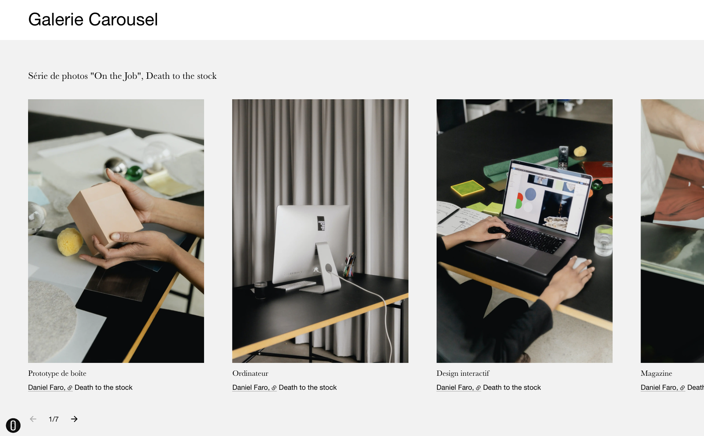
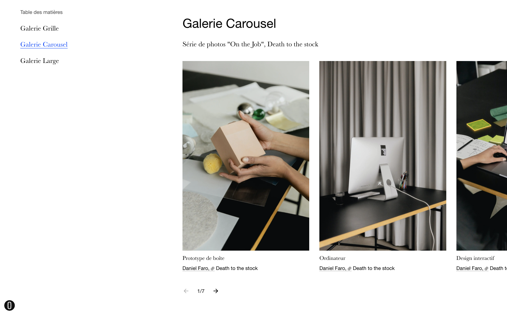
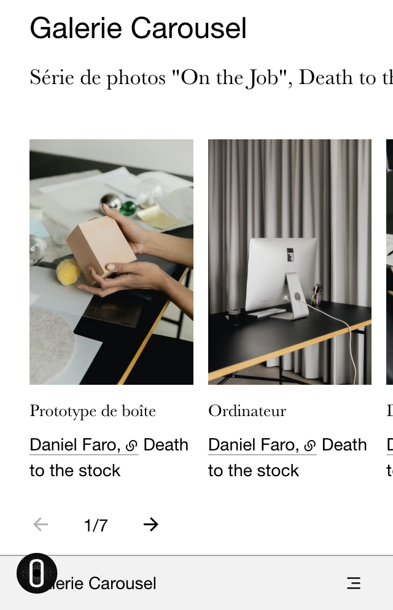

#### Bloc actualités 

En mise en page carousel.

Options par défaut:
- flèches de navigation

> Plus d'informations sur les options de navigation des carousels dans la partie [Contrôles du carousel](#contrôle-du-carousel).

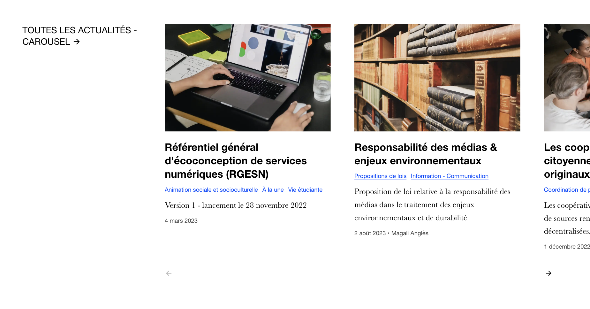
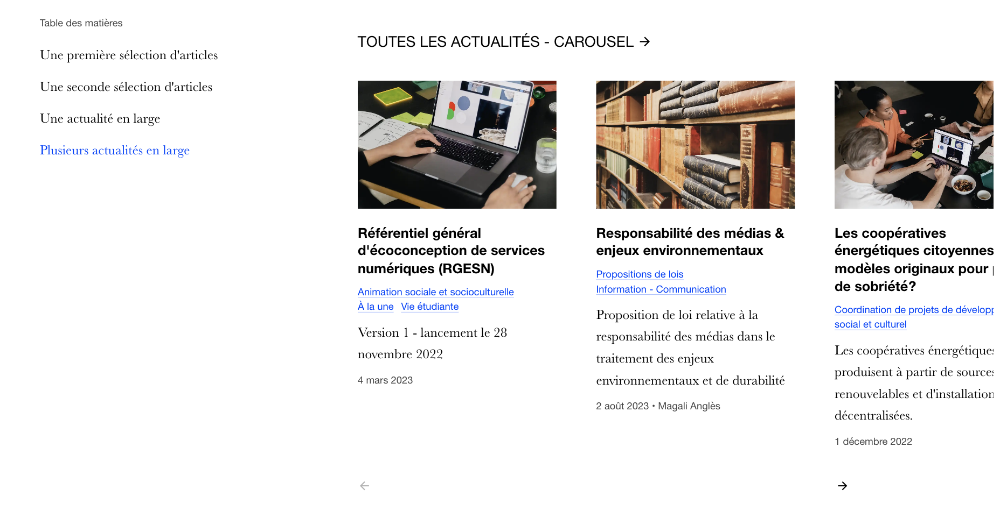
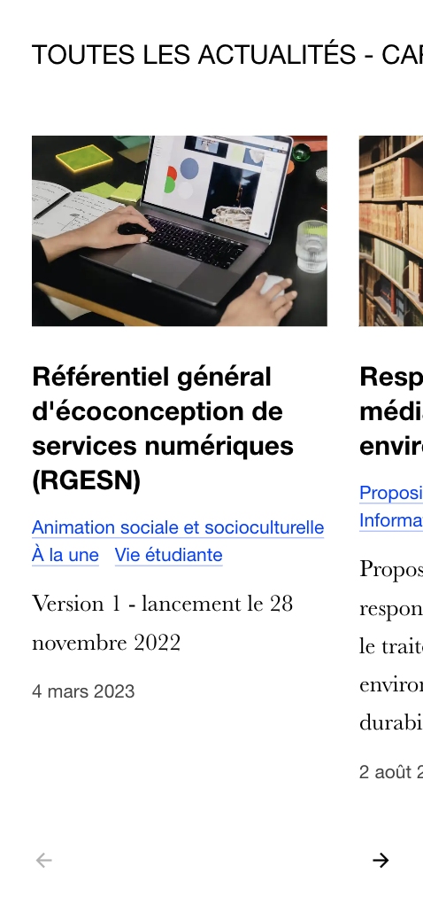

#### Bloc témoignages

Uniquement quand il y a plusieurs témoignages.

Fonctionne comme des reels Instagram, tourne tout seul avec des barres de progression et un bouton play/pause.

Options par défaut: 
- pagination
- autoplay

> Plus d'informations sur les options de navigation des carousels dans la partie [Contrôles du carousel](#contrôle-du-carousel).

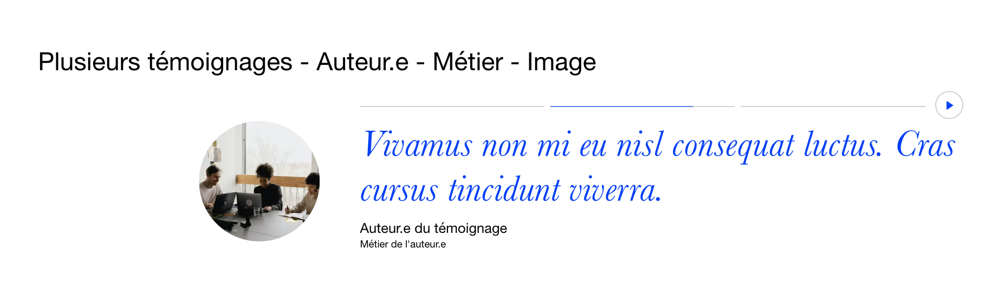
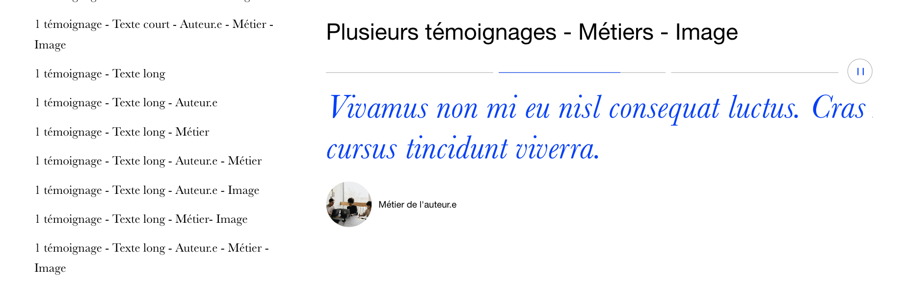
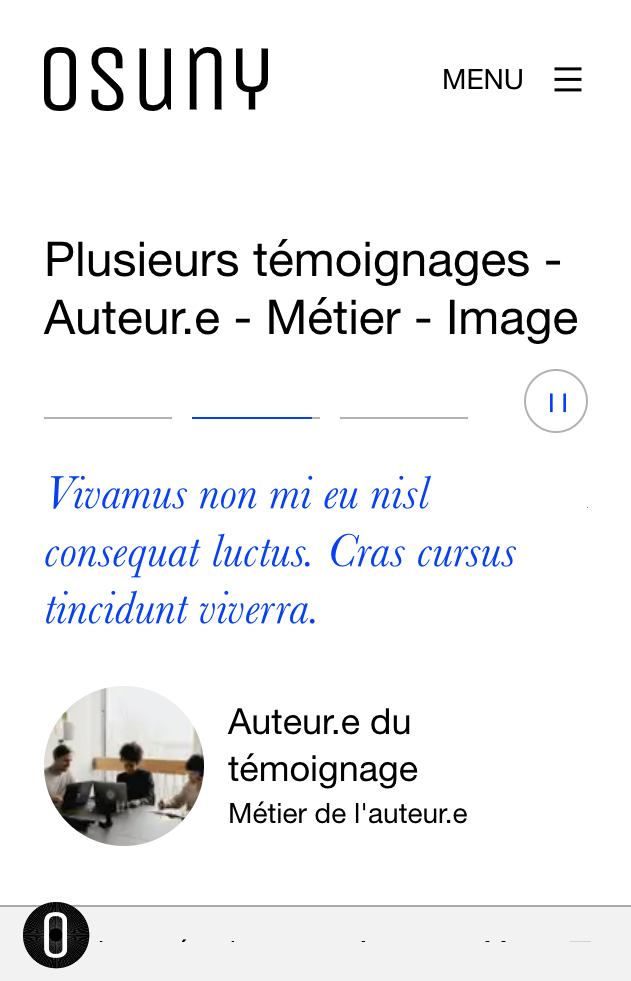

#### Bloc frise chronologique

En affichage horizontal. 

Options par défaut:
- flèches de navigation
> Plus d'informations sur les options de navigation des carousels dans la partie [Contrôles du carousel](#contrôle-du-carousel).

Ce block affiche aussi un indicateur du nombre de slides et du numéro de slide courant.

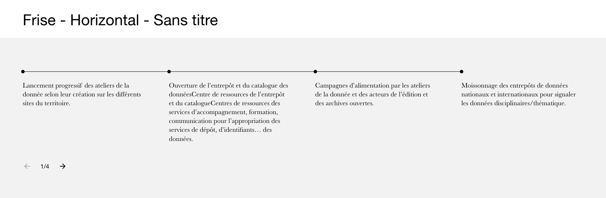
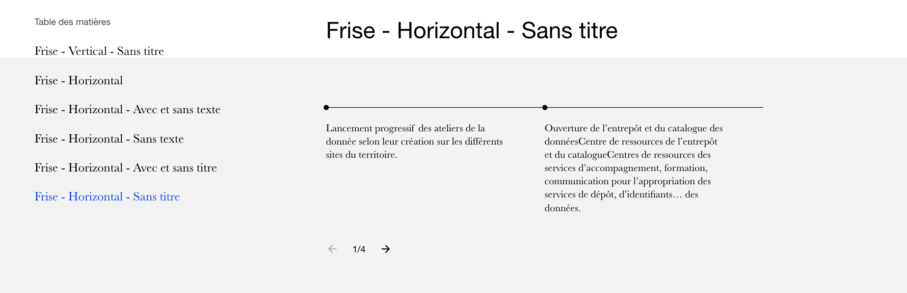
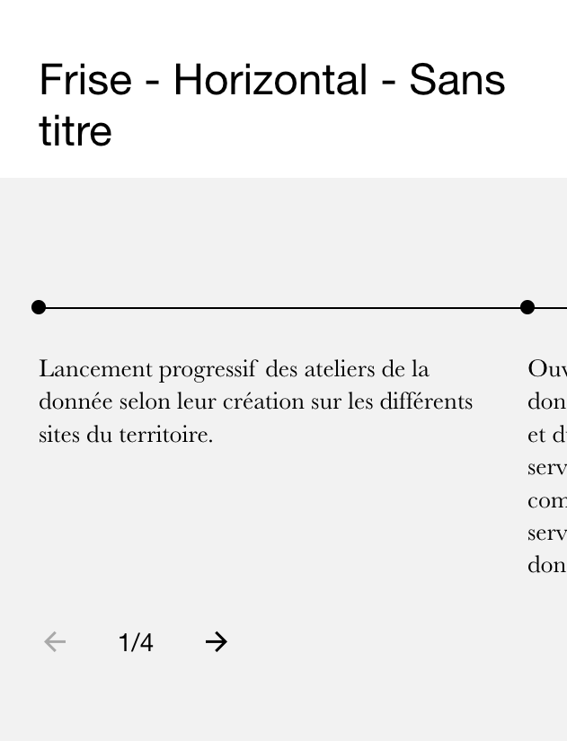

### Contrôles du carousel
Chaque carousel permet de naviguer entre les slides par un scroll horizontal (sur écran tactile un swipe horizontal).
Par ailleurs, et conformément aux recommendations WCAG 2.1, la navigation (slide suivant, slide précédent) se fait également au clavier en appuyant sur la touche "arrowLeft" et "arrowRight".

> [**Critère d'accessibilité 7.3**](https://accessibilite.numerique.gouv.fr/methode/criteres-et-tests/#7.3): Chaque script est-il contrôlable par le clavier et par tout dispositif de pointage (hors cas particuliers) ? 

Ensuite, deux modes de navigation sont possible selon les options: une pagination avec un bouton pour chaque slide, ou bien deux boutons flèches (gauche/droite). 

Dans le cas de l'option d'autoplayer, un bouton permettant l'arrêt du défilement est affiché.
> [**Critère d'accessibilité 13.8**](https://accessibilite.numerique.gouv.fr/methode/criteres-et-tests/#13.8):
Dans chaque page web, chaque contenu en mouvement ou clignotant est-il contrôlable par l’utilisateur ? 

## Implémentation

### HTML

#### Carousel
Les carousels sont composés d'un conteneur `js-carousel` disposant d'un conteneur slider et d'un conteneur pour la navigation (pagination ou flèches).
``` HTML {filename="Exemple de la structure d'une conteneur carousel dans le cas de la pagination, avec autoplay"}
<div class="testimonials">
  <div  id="js-carousel-5"
        class="carousel js-carousel" 
        data-carousel="{'autoplay':true, 'autoplayinterval':5000, 'pagination':true, 'arrows':false}">
    <div class="carousel__slider">
        ... 
    </div>

    <div class="carousel__pagination">
        ...
    </div>
  </div>
</div>
```

``` HTML {filename="Exemple de la structure d'une conteneur carousel dans le cas des flèches, sans autoplay"}
<div class="timeline">
  <div  id="js-carousel-2" 
        class="carousel js-carousel" 
        data-carousel="{'autoplay':false, 'pagination':false, 'arrows':true}">
    <div class="carousel__slider">
        ... 
    </div>

    <div class="carousel__arrows">
        ...
    </div>
  </div>
</div>
```

#### Slider
Le slider est composé d'un conteneur dans lequel les slides (figures) défilent au scroll.
``` HTML {filename="Conteneur de slides"}
<div class="carousel__slider">
  <div id="js-carousel-5-items" class="carousel__container">
    <figure id="js-carousel-5-item-0" aria-hidden="false" tabindex="0"> ... </figure>
    <figure id="js-carousel-5-item-1" aria-hidden="true" tabindex="-1"> ... </figure>
    <figure id="js-carousel-5-item-2" aria-hidden="true" tabindex="-1"> ... </figure>
  </div>
</div>
```

#### Pagination
Dans le cas de la pagination, une liste de boutons activant le slide correspondant est affiché.
``` HTML {filename="Conteneur de pagination"}
<div class="carousel__pagination">
  <ul class="carousel__pagination__tabcontainer has_toggle">
    <li>
      <button aria-controls="js-carousel-5-item-0"
              aria-current="true"
              aria-selected="true"
              aria-describedby="title-js-carousel-5"
              type="button">
        <span class="sr-only">Aller au slide 0</span>
        <i></i>
      </button>
    </li>
    <li>
      <button aria-controls="js-carousel-5-item-1"
              aria-current="false"
              aria-selected="false"
              aria-describedby="title-js-carousel-5" 
              type="button">
        <span class="sr-only">Aller au slide 1</span>
        <i></i>
      </button>
    </li>
    <li>
      <button aria-controls="js-carousel-5-item-2"
              aria-current="false"
              aria-selected="false"
              aria-describedby="title-js-carousel-5" 
              type="button">
        <span class="sr-only">Aller au slide 2</span>
        <i></i>
      </button>
    </li>
  </ul>
</div>
```

``` HTML {filename="Si l'autoplayer est actif un bouton activant ou désactivant l'autoplayer est affiché"}
<button aria-describedby="title-js-carousel-5"
        class="toggle toggle__playing">
  <span class="play" aria-hidden="true">
    <span class="sr-only">Carousel actuellement en pause. Démarrer le carousel</span>
  </span>
  <span class="pause" aria-hidden="false">
    <span class="sr-only">Carousel en cours de lecture. Mettre en pause le carousel</span>
  </span>
</button>
```

#### Flèches
Dans le cas des flèches de navigation, deux boutons de flèches ainsi qu'on compteur de slides sont affichés.
``` HTML {filename="Conteneur de navigation par les flèches"}
<div class="carousel__arrows">
  <button aria-describedby="title-js-carousel-5"
          class="arrow-prev" 
          disabled=""
          type="button">
      <span class="sr-only" aria-hidden="true">Aller à l'élément précédent</span>
  </button>
  <p class="counter">1/4</p>
  <button class="arrow-next" type="button">
      <span class="sr-only" aria-hidden="false">Aller à l'élément suivant</span>
  </button>
</div>
```

### Javascript

  Les 2 premiers objets sont par ordre logique.


#### Manager

Manager est chargé de l'instanciation de tous les carousels d'une page. 

Il est responsable de transmettre les événements de redimension de la fenêtre à tous les carousels, et détecte quels sont les carousels visibles, et qui ont le focus.

Il se charge aussi des attributions de nom de classe, d'id et d'attributs aria nécessaires à la navigation pour les personnes mal-voyantes ou naviguant au clavier.

#### Carousel

L'instance de carousel représente 1 carousel dans la page.
Elle est en charge des événements et agit comme un chef d'orchestre.


  Les objets suivants sont par ordre alphabétique.


#### Arrows

Gestion des flèches et du numéro 1/4.

#### Autoplayer

L'autoplayer se charge de passer automatiquement le carousel au prochain slide, à un intervalle donné.

Il est contrôlé par 4 fonctions qui permettent de : 
- mettre en pause `pause()`, reprendre `unpause()` l'autoplay,
- mettre en pause sans remettre le compteur de temps à zero `softPause()`, reprendre `softUnpause()` l'autoplay,
- arrêter `stop()`, Démarrer `start()` l'autoplay.

Il met également à jour la progression de l'UI dans la pagination dans le cas où celle-ci est active.

#### Classes

Liste des classes HTML utilisées dans le DOM.

#### Config

Configuration d'une instance de carousel.

#### Events

Liste des événements Javascript émis.

#### Pagination

Système de contrôles du carousel.
Gère l'état de l'autoplayer (démarré ou arrêté) avec le bouton play/pause.

#### PaginationButton

Représente un bouton de pagination, avec sa progression dans le cas de l'autoplay. 
Au click le bouton amène vers le slide correspondant.

#### Slide

La classe qui gère 1 slide, avec son état (previous, current, next...).

#### Slider

Slider est l'ensemble des slides qui se déplacent horizontalement. 
Il est chargé du calcul de translations en fonction de l'index de slide visé.
Il est composé d'un tableau de `Slide`.

### Attributs et comportements spécifiques à l'accessibilité

#### Attributs des contrôles (flèches et pagination)
Les intitulés des flèches de navigation et des boutons de pagination sont retranscrits grâce à un `<span>` contenant la déscription, caché visuellement grâce à la classe css `sr-only`. 

``` HTML {filename="Exemple de contenu informatif réstitué uniquement pour les technologies d'assistance"}
<span class="sr-only" aria-hidden="true">Aller à l'élément précédent</span>
```

Tous les boutons de contrôles sont dotés d'un attribut `aria-describedby` correspondant au titre du carousel. 
Il est donc recommandé d'ajouter un titre au carousel, autrement, avec un lecteur d'écran, il ne sera pas possible de savoir à quel contenu les contrôles (flèches et boutons de pagination) correspondent. 

``` javaScript {filename="manager.js"}
_setCarouselAriaDescribedBy (carousel) {
    var parent = carousel.element.parentElement,
        blockTitle = parent ? parent.querySelector('.block-title') : null;
    if (blockTitle) {
        blockTitle.setAttribute('id', 'title-'+carousel.id);
        carousel.element.querySelectorAll('button').forEach(function (child) {
            child.setAttribute('aria-describedby', String(blockTitle.getAttribute('id')));
        }.bind(this));
    }
}
```

Dans le cas spécifique de la pagination, utilisée par exemple dans le bloc "témoignages", le bouton correspondant au slide actif prend un attribut : `aria-current="true"`.

``` HTML {filename="Comportement des boutons de pagination"}
<li>
  <button aria-controls="js-carousel-5-item-0"
          aria-current="true" 
          aria-describedby="title-js-carousel-5" 
          aria-selected="true" 
          type="button">
    <span class="sr-only">Aller au slide 0</span>
    <i></i>
  </button>
</li>
<li>
  <button aria-controls="js-carousel-5-item-1"
          aria-current="false"
          aria-describedby="title-js-carousel-5"
          aria-selected="false"
          type="button">
    <span class="sr-only">Aller au slide 1</span>
    <i></i>
  </button>
</li>
```

``` javaScript {filename="paginationButton.js"}
setAriaCurrent (current) {
    this.element.setAttribute('aria-current', String(current));
}
```

#### Comportement à la navigation
Au scroll dans la page, s'il y a plusieurs carousels dans la page, un calcul est fait pour déterminer parmi tous les carousels, lequel d'entre eux obtiendra le focus et les actions du clavier. De cette manière, le carousel focusable est celui qui est visible, et verticalement le plus au centre de la fenêtre. 

`_findBestCarouselFocusCandidate()` renvoie le carousel verticalement le plus au centre de la fenêtre.

``` javaScript {filename="manager.js"}
_findBestCarouselFocusCandidate: function () {
    // On démarre avec la plus grande distance possible
    var distance = window.innerHeight,
        bestCandidate = null,
        i = 0,
        carousel,
        currentDistanceToCenter;
    for (i = 0; i < this.carousels.length; i += 1) {
        carousel = this.carousels[i];
        carousel.state.hasFocus = false;
        currentDistanceToCenter = Math.abs(carousel.getCenterPositionY() - this.windowCenterY);
        if (currentDistanceToCenter < distance) {
            distance = currentDistanceToCenter;
            bestCandidate = carousel;
        }
    }
    if (bestCandidate) {
        bestCandidate.state.hasFocus = true;
    }
    return bestCandidate;
}
```

À l'activation d'un nouveau slide du carousel (au clavier, ou bien au click sur un bouton de navigation), le focus vient se positionner sur l'élément complètement visible qui vient d'apparaître à l'écran.

Ainsi, à chaque changement de position horizontale, un calcul est fait pour déterminer si le slide est complètement visible ou non.

> [**Critère d'accessibilité 10.7**](https://accessibilite.numerique.gouv.fr/methode/criteres-et-tests/#10.7): Dans chaque page web, pour chaque élément recevant le focus, la prise de focus est-elle visible ?  

La fonction `_slideIsVisible(index)` retourne `true` si le slide à l'index `index` est complètement visible, `false` sinon.
``` javaScript {filename="slider.js"}
_slideIsVisible: function (index) {
    var slidePos = {
        min: null,
        max: null
    };
    slidePos.min = this._slidePosition(index) - this.element.scrollLeft;
    slidePos.max = slidePos.min + this.slides[index].width;
    return slidePos.min >= -2 && slidePos.max <= Math.min(window.screen.width - this.element.getBoundingClientRect().left, this.containerWidth) + 2;
}
``` 
`_slidePosition(index)` retourne la position du slide à l'index `index` dans le tableau de slides qui composent le slider.
``` javaScript {filename="slider.js"}
_slidePosition: function (index) {
    var position = 0,
        i;
    for (i = 0; i < index; i += 1) {
        position += this.slides[i].width;
    }
    return position;
}
```

Les slides qui ne sont pas visibles ou partiellement visibles sont cachés pour les lecteurs d'écran avec un `aria-hidden="true"` et rendus non-focusables avec un `tabindex=-1`, de même que tous les éléments interactifs contenu dans ce slide (`<a>`, `<button>`, `<iframe>`).

> [**Critère d'accessibilité 10.8**](https://accessibilite.numerique.gouv.fr/methode/criteres-et-tests/#10.8): Pour chaque page web, les contenus cachés ont-ils vocation à être ignorés par les technologies d’assistance ? 

``` HTML {filename="Exemple de changements d'états des slides"}
<figure id="js-carousel-5-item-0" 
        aria-hidden="false" 
        class="testimonial with-picture is-current" tabindex="0">
    ...
</figure>
<figure id="js-carousel-5-item-1" 
        aria-hidden="true" 
        class="testimonial with-picture is-next" tabindex="-1">
    ...
</figure>    
...
```
``` javaScript {filename="slide.js"}
setInteractivityState (slideVisible) {
    var focusableSubElements = ['a', 'button', 'iframe'];
    this.visible = slideVisible;
    this.setFocusable(this.container);
    focusableSubElements.forEach(function (element) {
        this.container.querySelectorAll(element).forEach(function (e) {
            this.setFocusable(e);
        }.bind(this));
    }.bind(this));
},
setFocusable (element) {
    element.setAttribute('aria-hidden', String(!this.visible));
    if (this.visible) {
        element.setAttribute('tabindex', String(0));
    } else {
        element.setAttribute('tabindex', String(-1));
    }
}
```
