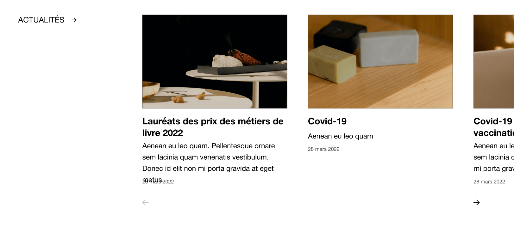
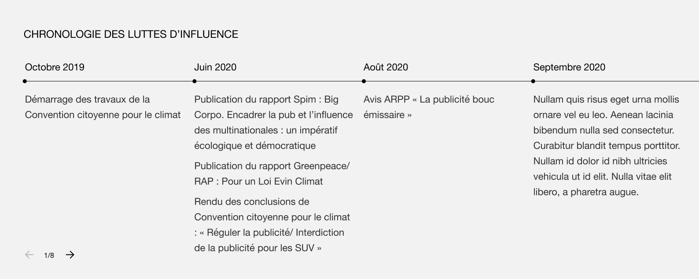

## Fonctionnalités

### Bloc galerie en mise en page carousel

Avec des flèches et des numéros.

### Bloc actualités en mise en page carousel

### Bloc témoignages

Uniquement quand il y a plusieurs témoignages.
Fonctionne comme des reels Instagram, tourne tout seul avec des barres de progression et un bouton play/pause.

### Bloc frise chronologique

Avec des flèches et des numéros.

## Implémentation

### Manager

Manager est chargé de l'instanciation de tous les carousels d'une page. 

Il est responsable de transmettre les événements de redimension de la fenêtre à tous les carousels, et détecte quels sont les carousels visibles, et qui ont le focus.s

### Carousel

L'instance de carousel représente 1 carousel dans la page.
Elle est en charge des événements et agit comme un chef d'orchestre.


  Les objets suivants sont par ordre alphabétique.


### Arrows

Gestion des flèches et du numéro 1/4.

### Autoplayer

L'autoplayer se charge de passer automatiquement le carousel au prochain slide, à un intervalle donné.

Il est contrôlé par 4 fonctions qui permettent de : 
- mettre en pause `pause()`, reprendre `unpause()` l'autoplay,
- arrêter `stop()`, Démarrer `start()` l'autoplay.

Il met également à jour la progression de l'UI dans la pagination dans le cas où celle-ci est active.

### Classes

Liste des classes HTML utilisées dans le DOM.

### Config

Configuration d'une instance de carousel.

### Events

Liste des événements Javascript émis.

### Pagination

Système de contrôle du carousel.
Gère l'état de l'autoplayer (démarré ou arrêté) avec le bouton play/pause.

### PaginationButton

Représente un bouton de pagination, avec sa progression dans le cas de l'autoplay. 
Au click le bouton amène vers le slide correspondant.

### Slide

La classe qui gère 1 slide, avec son état (previous, current, next...).

### Slider

Slider est l'ensemble des slides qui se déplacent horizontalement. 
Il est chargé du calcul de translations en fonction de l'index de slide visé.
Il est composé d'un tableau de `Slide`.

### Utils

Quelques fonctions d'utilité, pour rester DRY.
