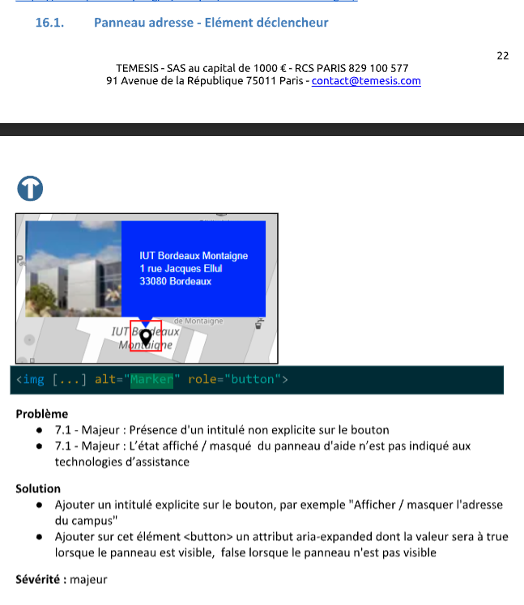

Les `organisations` et les `campus` on un affichage en mode carte.

## Composant de carte

Les cartes permettent une visualisation cartographique de lieux, comme les organisations ou les campus. Elles s'appuient sur la librairie open source Leaflet et Open Street Map.

## Accessibilité

Suite à l'audit réalisé en octobre 2024, nous avons pu échanger avec [Temesis](https://www.temesis.com/) au sujet de l'intégration correcte de la carte et de son usage via un lecteur d'écran et/ou clavier.

Le rapport du contre audit, en date du 15 octobre, indiquait ceci :

Aurélien Levy, directeur général de Temesis, nous a ensuite précisé de nouveaux points le 14 novembre :

- Afin de palier au manque de conformité de la librairie Leaflet et pour faciliter sa compréhension par le plus grand nombre de personnes, il est intéressant de lister hors de la carte, dans une liste `<ul>` les lieux et adresses.
- Par le fait, il nous est recommandé de masquer aux lecteurs d'écran les pins (markers) des lieux et d'empêcher le focus et l'utilisation du clavier ouverture/fermeture de la popin associé à chaque pin.
- En revanche, la carte resterait "accessible" par l'ajout d'un role `region` sur son contenant, avec un `aria-label` précisant la nature du contenu (par exemple: "*Localisation des campus*") ou un fallback comme "Vue cartographique" si le titre du bloc n'est pas contribué.
- Dans ce cas, il est possible d'ajouter un `aria-describedby` expliquant que la carte est interactive et que l'on peut utiliser les flèches clavier pour naviguer dedans.
- La carte étant donc accessible au clavier, il faudrait également rendre accessible les fonctionnalités de la carte et traduire les contenus en anglais : zoom / dézoom, crédit Leaflet et Open Street Map.
