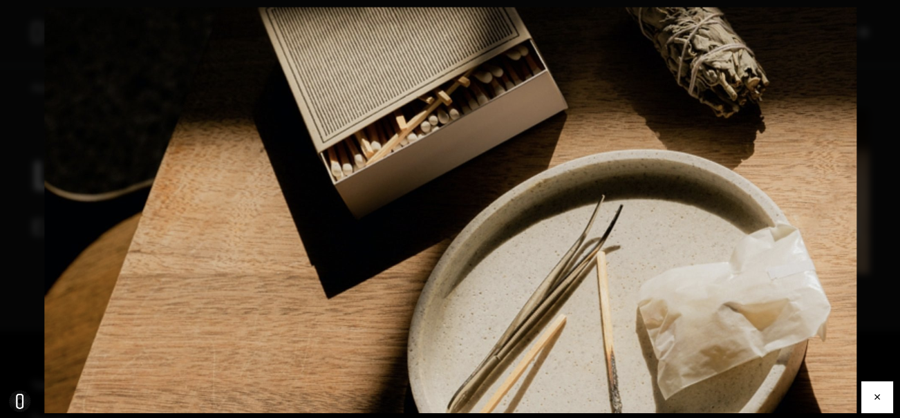
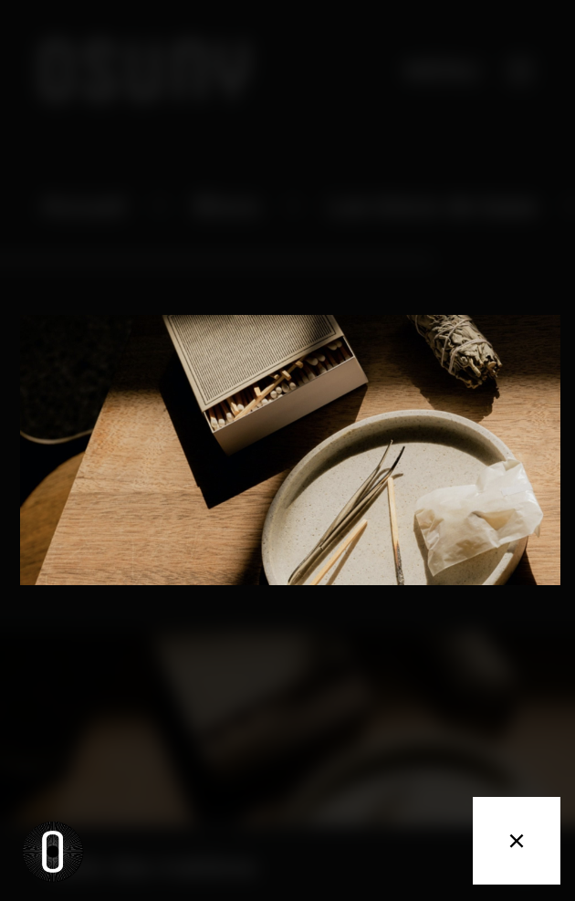
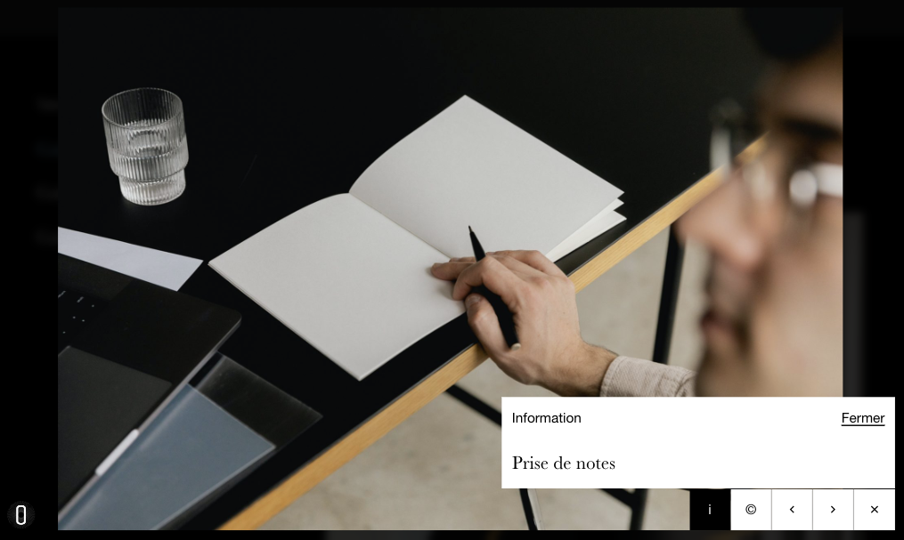

## Fonctionnalités
### Contextes
La visionneuse est une option activable dans le fichier `config.yaml` dans deux contextes: 
Le premier contexte est celui d'une image seule, pour lequel si l'option `disabled` est à `false` permet, au click sur toute image du site, de l'ouvrir dans une visionneuse.

``` yaml
params:
  image_sizes:
    design_system:
      lightbox:
        disabled: false #true to disable
```

Le second contexte est celui du bloc galerie pour lequel l'option `disabled: false`, permet, au click sur une image de la galerie, d'ouvrir l'image dans une visionneuse et de naviguer entre les différentes images composant la galerie.

``` yaml
params:
  image_sizes:
    design_system:
      gallerylightbox:
        disabled: false #true to disable
``` 
### Affichage




 en affichage desktop")
 en affichage mobile")

### Comportement
Au click sur une image, cette dernière apparait en grand, dans une visionneuse prenant toute la taille de l'écran.
Une fois la visionneuse ouverte, la fermeture peut se faire de plusieurs manières: 
- Au click sur le bouton en forme de croix affiché en bas à droite de la visionneuse
- Au click sur l'espace autour de l'image dans la visionneuse
- En appuyant sur la touche `escape` du clavier

Dans le cas d'une galerie, la navigation entre les images se fait de plusieurs manières: 
- Au click sur un des boutons en forme de flèche (gauche/droite) affiché en bas à droite de la visionneuse
- En appuyant sur la touche `arrowLeft` ou `arrowRight` du clavier

Dans Osuny, les images peuvent être associées d'un crédit et d'une description.
Si l'une, l'autre, ou les deux de ces informations sont disponibles, le ou les boutons "©" pour le crédit et "i" pour la description, apparaissent en bas à droite de l'écran.

Au click sur un de ces boutons, le contenu de l'information est ouvert dans une fenêtre de type pop-in.
Une fois ouverte, cette pop-in peut être fermée en cliquant sur le bouton "fermer", ou bien en cliquant sur le bouton "©" ou "i" activé.




### Controls
C'est l'interface de contrôle de la visionneuse.
Elle dispose, des boutons suivants :
- Information : si l'image dispose d'une description
- Crédit : si l'image dispose d'un crédit
- flèche de gauche : s'il y a une image précédente
- Flèche de droite : s'il y a une image suivante
- Fermer : toujours présent

Lors d'un clic sur un bouton, il déclenche un événement correspondant.

``` HTML {filename="Boutons de l'interface de contrôle"}
<button class="info">
  <span class="sr-only">Afficher les informations de l'image</span>
</button>
<button class="credit">
  <span class="sr-only">Afficher les crédits de l'image</span>
</button>
<button class="prev">
  <span class="sr-only">Aller à l'image précédente</span>
</button>
<button class="next">
  <span class="sr-only">Aller à l'image suivante</span>
</button>
<button class="close">
  <span class="sr-only">Fermer la lightbox</span>
</button>
```

### Implémentation HTML

Afin d'allèger le HTML et de ne pas surcharger d'éléments le DOM, on ajoute un bouton après chaque média que l'on peut ouvrir en plus grand.


