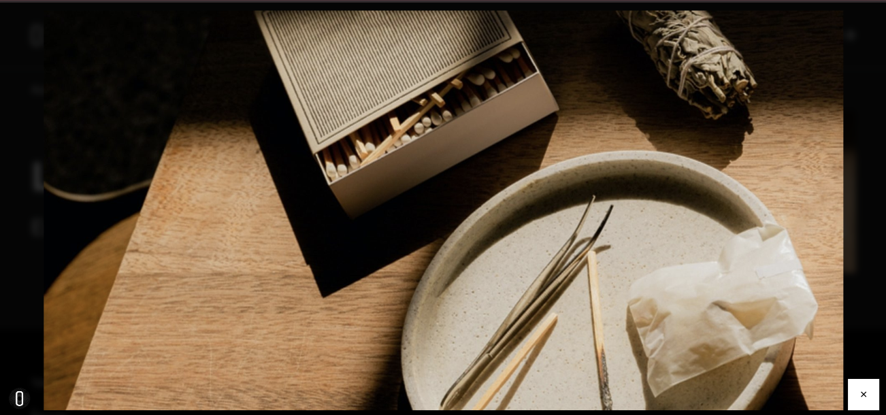
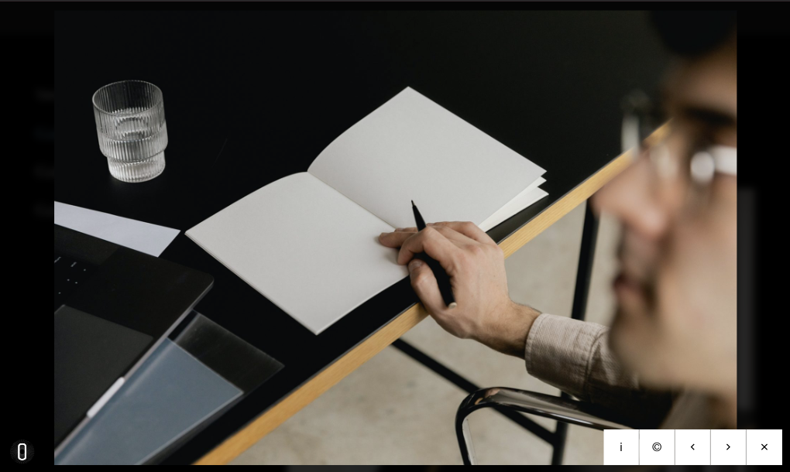
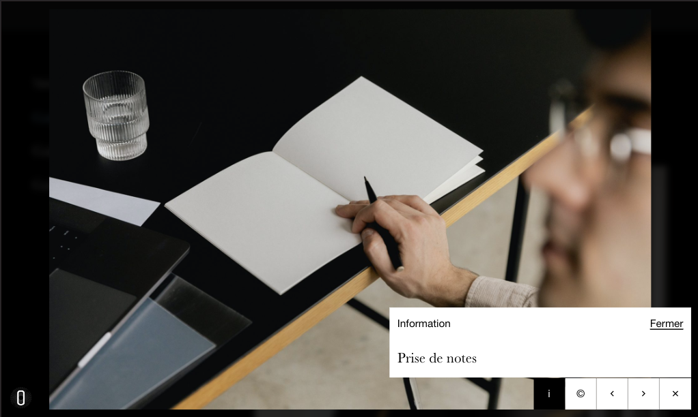

## Fonctionnalités

### Visionneuse ouverte contenant une seule image

### Visionneuse ouverte contenant plusieurs images

### Visionneuse ouverte contenant plusieurs images avec la fenêtre de déscription ouverte.

## Implémentation


  Les 2 premiers objets sont par ordre logique.


### Manager
Manager est chargé de l'instanciation de toutes les visionneuses d'une page. 
Il gère un conteneur dont il va charger le contenu en fonction de l'image activée.
Il gère aussi les événements de la page.

### Container
Container est l'élément qui s'affiche en modale ou non.
Le manager lui injecte le contenu de l'image correspondante.

Il contient les fonctions `open()` et `close()` qui vont changer son état d'affichage, `show()` qui va charger les informations de l'image (lightbox) à afficher. 

Il instancie aussi l'interface de contrôles ainsi que la fenêtre d'affichage des informations et crédits.

En fonction des données de l'image chargée, il mettra à jour ces deux composants.

### Lightbox

L'instance de lightbox représente une image de la page et ses infos.
Elle détermine également si l'image a une image précédente / suivante ou non et son index.


  Les objets suivants sont par ordre alphabétique.


### Classes

Liste des classes HTML utilisées dans le DOM.

### Controls
C'est l'interface de contrôle de la visionneuse. 
Elle dispose, des boutons suivants :
- Information : si l'image dispose d'une description
- Crédit : si l'image dispose d'un crédit
- flèche de gauche : s'il y a une image précédente
- Flèche de droite : s'il y a une image suivante
- Fermer : toujours présent
  
Lors d'un clic sur un bouton, il déclenche un événement correspondant

### Events

Liste des événements Javascript émis.

### PopupDetails
Fenêtre d'affichage des informations ou dex crédits. 
Le popup est mise à jour à chaque changement d'image `load()`
Elle peut montrer les crédits ou description `show(content)`, et se fermer `close()`.
