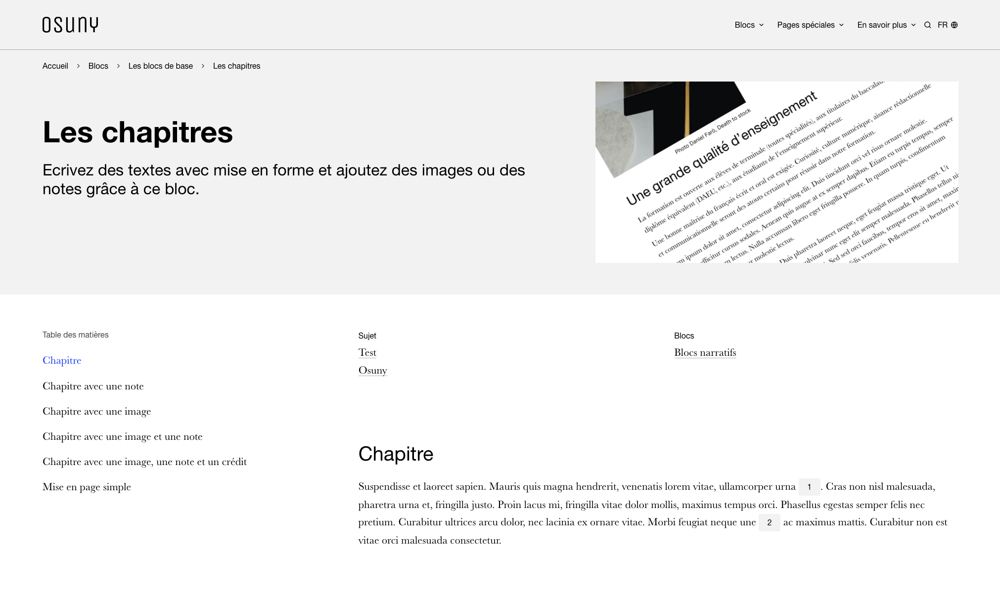
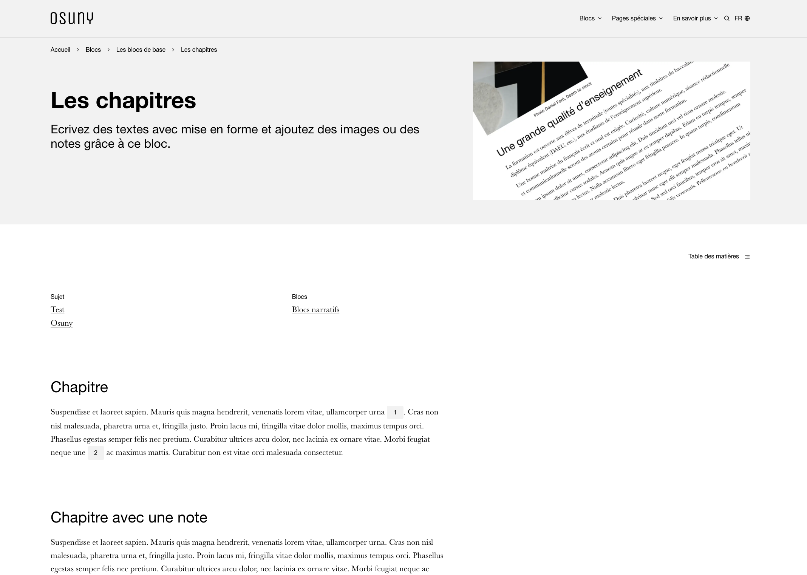
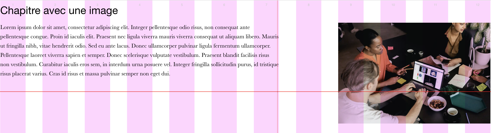
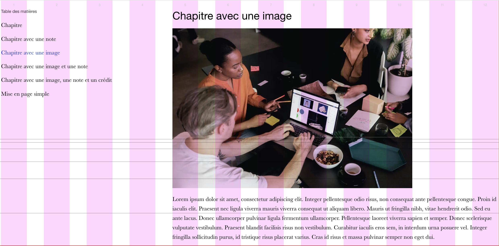

## Principe

Les pages peuvent se comporter de deux manières : 

### 1. Largeur partielle : avec une barre latérale qui contient les meta et la table des matières



### 2. Pleine largeur : avec une table des matières rétractée




#### En cascade sur les blocs

Un bloc s'affichera différement en fonction de l'agencement de la page. Le style est modifié à partir d'une bodyclass `full-width` ou de l'absence de cette classe.

1. Pleine largeur



2. Largeur partielle




#### Blocs de pied de page

Avec le déploiement des blocs de pied de page, deux `layouts` doivent cohabiter : pleine largeur et largeur partielle.

L'usage de la bodyclass devient dès lors problèmatique car elle n'influence plus le style de l'entièreté de la page : il faut alors "défaire" le style des blocs de pied de page.

##### Piste

Descendre la classe du layout de page au niveau du bloc. 

Par exemple : 

```<div class="block block-chapter block-chapter--alt_background block--full-width">```

### Terminologie

> Afin d'éviter la confusion entre layouts des blocs et de page, d'autres termes sont envisageables : 
> - format
> - composition
> - contexte de page (déjà réservé en hugo)
> - design de page (très générique, mais plus proche de la `data`)
> - template (déjà réservé dans les blocs)
