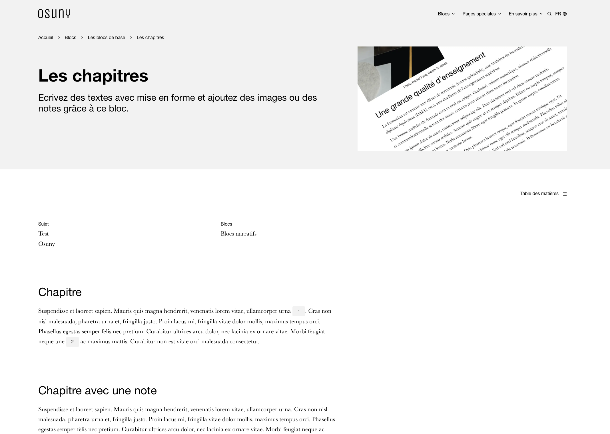
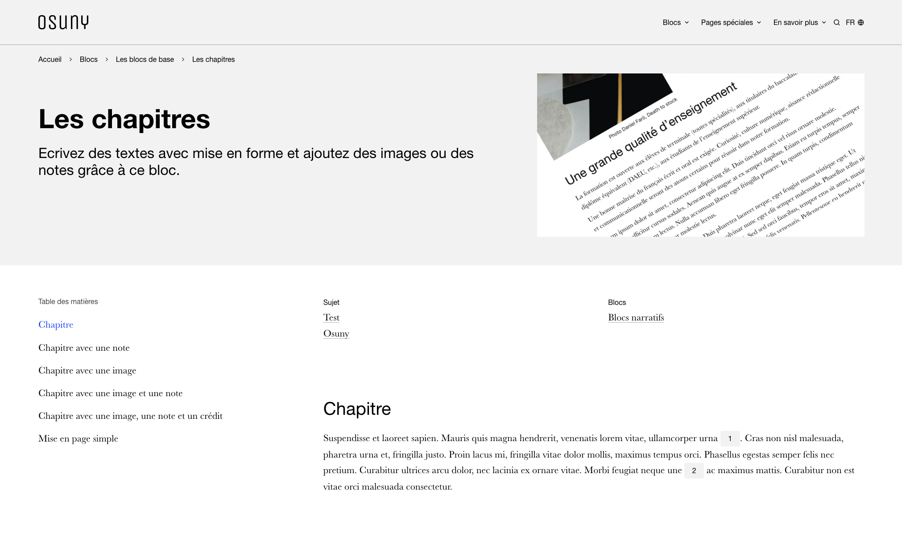
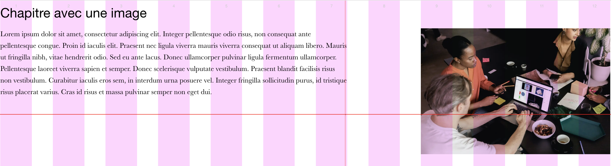
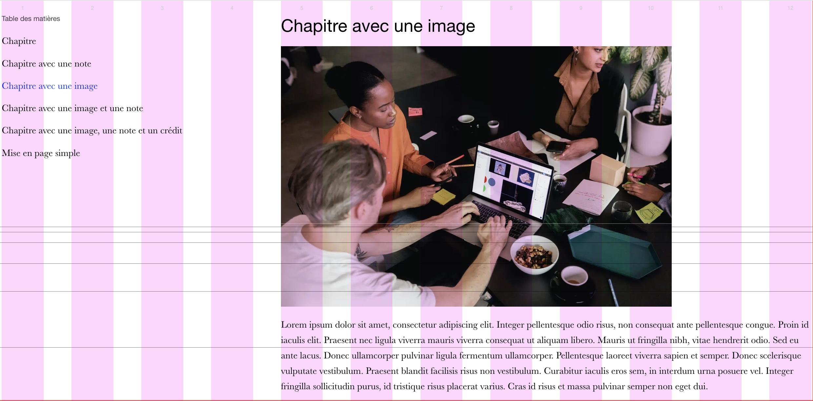

## Principes

Il existe deux types de mises en page :

- Layout de page, modifie l'ensemble de l'affichage de la page (macro). Les modifications ne s'appliquent qu'en format `desktop` ou au dessus.
- Layout de bloc, modifie l'affichage d'un bloc uniquement (micro)

### Layouts de page (macro)

1. Pleine largeur



2. Largeur partielle



3. Centrée

Cette mise en page est présente dans le figma mais n'est pas encore disponible

> Afin d'éviter la confusion entre layouts des blocs et de page, d'autres termes sont envisageables : 
> - format
> - composition
> - contexte de page (déjà réservé en hugo)
> - design de page (très générique, mais plus proche de la `data`)
> - template (déjà réservé dans les blocs)


#### Layout de page en cascade sur les blocs

Un bloc s'affichera différement en fonction du `layout de page`. Le style est modifié à partir d'une bodyclass `full-width` ou de l'absence de cette classe.

1. Pleine largeur



2. Largeur partielle




#### Blocs de pied de page

Avec le déploiement des blocs de pied de page, deux `layouts` doivent cohabiter : pleine largeur et largeur partielle.

L'usage de la bodyclass devient dès lors problèmatique car elle n'influence plus le style de l'entièreté de la page : il faut alors "défaire" le style des blocs de pied de page.

##### Piste

Descendre la classe du layout de page au niveau du bloc. 

Par exemple : 

```<div class="block block-chapter block-chapter--alt_background block--full-width">```

### Layouts de blocs (micro)

Les blocs ont différentes mises en page que l'on appelle `layout`. Certains sont standards, d'autres sont spécifiques.

#### Blocs de liste

Il existe des `layouts` standards pour les blocs de listes :

- alternate
- carousel
- cards
- grid
- large
- list

Pour ces blocs, on utilise des mixins pour factoriser les comportements.

```sass
@mixin layout-alternate
@mixin layout-carousel
@mixin layout-cards
@mixin layout-grid
@mixin layout-large
@mixin layout-list
```

Un mixin permet d'appliquer une sélection de `layouts` par défaut :

```sass
@mixin layout-defaults($selector)
    ul#{$selector}
        @include list-reset
    #{$selector}
        &--alternate
            @include layout-alternate
        &--grid
            @include layout-grid
        &--large
            @include layout-large
        &--list
            @include layout-list
```

##### Exemple :

Dans `/sass/_theme/sections/jobs.sass` :

```
@include layout-defaults(".jobs")
```

<!-- 
### Blocs spécifiques

D'autres `layouts` sont réservés à un ou plusieurs blocs.

TODO : lister les blocs et leur mise en page dans une page dédiée
#### Bloc chapitre : 

- simple (sans mise en avant)
- mise en avant légère
- mise en avant forte

#### Bloc appel à action : 

- mise en avant légère
- mise en avant forte
###  -->


## 