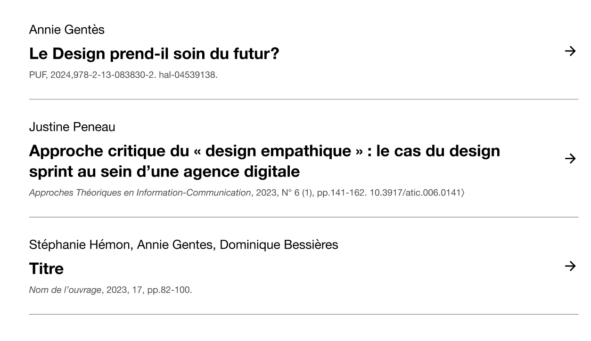

La liste suivante tente de fixer la situation projetée parfaite :
- en réparant les incohérences de nommage
- en prévoyant tous les cas
- en définissant de bonnes valeurs par défaut

Les options sont toutes dans `themes/osuny/config.yaml`, et les blocs doivent réutiliser la même structure.
Les valeurs par défaut des blocs sont les mêmes que celles des index.
Si une valeur manquait, il faudrait la considérer `false`.

## Actualités

*Le Monde, pour référence*


L'image et le résumé (ou chapô) sont présents, mais pas les dates, les catégories ou les auteurs.
Ce n'est évidemment pas un cas général, mais c'est un bon cas par défaut.
On remarque aussi qu'il manquait le `reading_time`.
La question du partage social est plus compliquée, ça doit être géré au niveau du site.
Si l'on ne veut pas de partage sur X, ça doit être global.


```YAML{filename="config/_default/config.yaml"}
  posts:
    index:
      options:
        author: false
        categories: false
        date: false
        image: true
        reading_time: false
        subtitle: true
        summary: true
    single:
      options:
        author: true
        categories: true
        date: true
        image: true
        reading_time: true
        subtitle: true
        summary: true
```

```YAML{filename="Bloc"}
  - kind: block
    template: posts
    data:
      layout: grid
      options:
        author: false
        categories: false
        date: false
        image: true
        reading_time: false
        subtitle: true
        summary: true
```

## Diplôme


```YAML{filename="config/_default/config.yaml"}
  diplomas:
    index:
      options:
        image: false
        programs: true
        summary: true
    single:
      options:
        image: true
        programs: true
        summary: true
```

```YAML{filename="Bloc"}
  - kind: block
    template: diploma
    data:
      options:
        image: false
        programs: true
        summary: true
```

## Événements


```YAML{filename="config/_default/config.yaml"}
  events:
    index:
      options:
        categories: false
        dates: true
        image: true
        subtitle: true
        summary: true
        status: false
    single:
      options:
        categories: true
        dates: true
        image: true
        subtitle: true
        summary: true
        status: true
```

```YAML{filename="Bloc"}
  - kind: block
    template: agenda
    data:
      layout: grid
      options:
        categories: false
        dates: true
        image: true
        subtitle: true
        summary: true
        status: false
```

## Formations


```YAML{filename="config/_default/config.yaml"}
  programs:
    index:
      options:
        diploma: true
        image: false
        summary: false
    single:
      options:
        diploma: true
        image: true
        summary: true
```

```YAML{filename="Bloc"}
  - kind: block
    template: programs
    data:
      layout: list
      options:
        diploma: true
        image: false
        summary: false
```

## Organisations


```YAML{filename="config/_default/config.yaml"}
  organizations:
    index:
      options:
        link: true
        logo: true
        summary: false
    single:
      backlinks: true
      options:
        link: true
        logo: true
        summary: true
```
L'affichage des backlinks est il une option ?
Si on dit oui, qu'est-ce que ça donne dans une liste des organisations ?
Concrètement, rien : on ne va pas afficher dans la liste des organisations, lié à chaque organisation, la liste des références à cette organisation.
On peut peut-être déduire que ce n'est pas une option, et le laisser à côté du nœud.

```YAML{filename="Bloc"}
  - kind: block
    template: organizations
    data:
      layout: grid
      options:
        link: true
        logo: true
        summary: false
```

## Pages


Les pages n'ont pas d'index et de single, elles sont les 2 à la fois.

```YAML{filename="config/_default/config.yaml"}
  pages:
    main_summary: true
    options:
      image: true
      summary: false
```

```YAML{filename="Bloc"}
  - kind: block
    template: pages
    data:
      layout: grid
      options:
        image: true
        summary: true
```

## Papiers


Les citations sont gérées dans l'admin.

```YAML{filename="config/_default/config.yaml"}
  papers:
    index:
      options:
        abstract: true
        authors: true
        dates: false
        kind: true
        pdf: true
        reading_time: false
        summary: true
        volume: true
    single:
      options:
        abstract: true
        authors: true
        dates: true
        kind: true
        pdf: true
        reading_time: true
        summary: true
        volume: true
```

```YAML{filename="Bloc"}
  - kind: block
    template: papers
    data:
      options:
        abstract: true
        authors: true
        dates: false
        kind: true
        pdf: true
        reading_time: false
        summary: true
        volume: true
```

## Personnes


```YAML{filename="config/_default/config.yaml"}
  persons:
    index:
      options:
        image: true
        summary: true
    single:
      options:
        image: true
        summary: true
```

Les personnes pourraient avoir beaucoup plus d'options, pour permettre de faire un annuaire.

```YAML{filename="Bloc"}
  - kind: block
    template: persons
    data:
      options:
        image: true
        summary: true
        link: true
```

## Projets


```YAML{filename="config/_default/config.yaml"}
  projects:
    index:
      options:
        categories: true
        image: true
        subtitle: true
        summary: false
        year: true
    single:
      options:
        categories: true
        image: true
        subtitle: true
        summary: true
        year: true
```

```YAML{filename="Bloc"}
  - kind: block
    template: papers
    data:
      layout: grid # list, alternate, large
      options:
        categories: true
        image: true
        subtitle: true
        summary: false
        year: true
```

## Publications



```YAML{filename="config/_default/config.yaml"}
  publications:
    index:
      metrics: true
      options:
        ref: true
        authors: true
    single:
      options:
        ref: true
        authors: true
```

```YAML{filename="Bloc"}
  - kind: block
    template: publications
    data:
      options:
        ref: true
        authors: true
```

## Sites (campus)


```YAML{filename="config/_default/config.yaml"}
  locations:
    index:
      options:
        image: true
        summary: true
    single:
      options:
        image: true
        summary: true
```

```YAML{filename="Bloc"}
  - kind: block
    template: locations
    data:
      layout: grid
      options:
        image: true
        summary: true
```

## Volumes


```YAML{filename="config/_default/config.yaml"}
  volumes:
    index:
      options:
        image: true
        summary: true
    single:
      options:
        image: true
        summary: true
```

```YAML{filename="Bloc"}
  - kind: block
    template: volumes
    data:
      options:
        image: true
        summary: true
```
