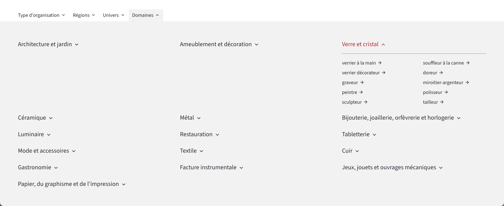

## Liste des modifications

### Configuration de la taille des images

Rangement et homogénéisation des configurations de la taille des images.

[En savoir plus](/docs/theme/architecture/taille-des-images/)

### Balisage `<ul>` et `<ol>` pour toutes les listes

> [!TIP]
> Amélioration d'accessibilité.

Remplacement des balises `<div>` par des listes html dans les blocs de liste.

> [!WARNING]
> Certains sélecteurs CSS ont été modifiés pour conserver le style.

### Focus-trap dans la table des matières

> [!TIP]
> Amélioration d'accessibilité.

Ajout d'un focus trap pour la table des matières.

https://github.com/osunyorg/theme/issues/1015


### Harmonisation des meta dans les blocs de liste

L'ordre d'affichage des catégories dans une liste est désormais toujours le même.

Les catégories se trouvent sous le résumé pour toutes les natures éditoriales.


  
  
  
  



https://github.com/osunyorg/theme/pull/1184

### Espacement verticaux

Pour simplifier et rendre plus robuste les espacements verticaux, on favorisera toujours l'usage d'une margin-top. Le `hero` ne pousse plus vers le bas, mais ce sont les contenus en dessous qui pousse vers le haut.

Cela permet de modifier le comportement en fonction de l'éléments suivant :

```
.hero + .document-content .block-class-specific-class
  margin-top: var(--grid-gutter)
```

### Contenus liés à une formation

Ajout des expositions


### Factorisation CSS des mises en forme

Application des mixins

```
# Mixins

layout-alternate
layout-cards
layout-carousel
layout-large
layout-list
layout-grid
```

[En savoir plus](/docs/theme/css/mise-en-page/)

### Fédération des actualités

Support de la fédération des actualités.

### Lazy loading d'image dans un bouton

Correction du chargement progressif des images dans les boutons d'ouverture de lightbox.

[En savoir plus](/docs/audit/accessibilite/audit-site/sujets-avances/#2-une-img-dans-un-button)

### Bloc formation

Meilleur affichage des informations


### Options d'affichage des filtres de catégories

Option pour afficher les filtres de catégories sur toutes les pages de catégories.

```
params:
  categories:
    single:
      taxonomies:
        display: false
```

### Gestion des catégories profondes

Gestion des arbres des catégories dans les filtres.



### Gestion de la qualité des images pour les écrans ayant un ratio de pixel > 1

Une option pour sélectionner le niveau de compression est ajouté :

```
params:
  keycdn:
    quality:
      default: 80
      high_ratio: 50
```

### Homogénéisation du séparateurs des meta

Seul le point médian `•` est désormais utilisé pour afficher une suite de meta.

### Factorisation des blocs de liste

L'homogénéisation des mise en forme des blocs de liste est accompagnée d'une factorisation du html et du css.


### Correction des données du bloc chapitre

Homogénéisation des données de l'image du bloc chapitre `alt` et `credit`.


### Gestion des sous-titre dans les catégories

Support des données des catégories : 

```
subtitle: >-
  Sous-titre
header_text: >-
  Titre haut de page
header_cta:
  label: >-
    Bouton
  target: "url du bouton"
  external: true
shared_image:
  id: "fb13e704-ad5c-45f8-8d83-c46c76136a99"
```