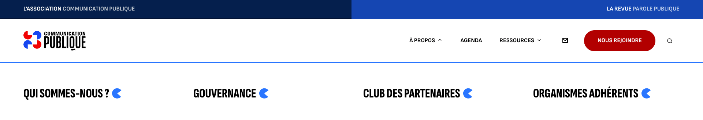
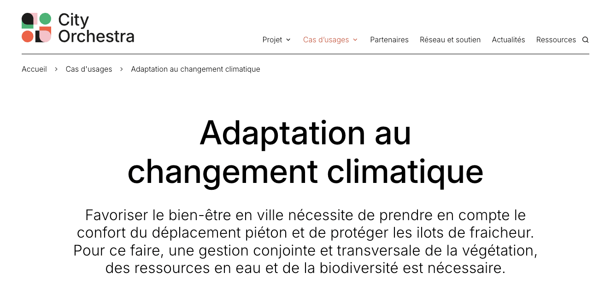
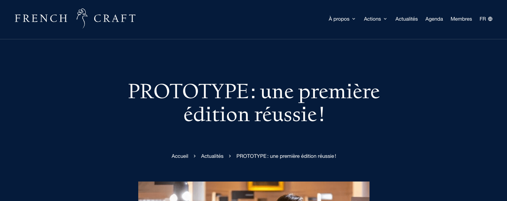
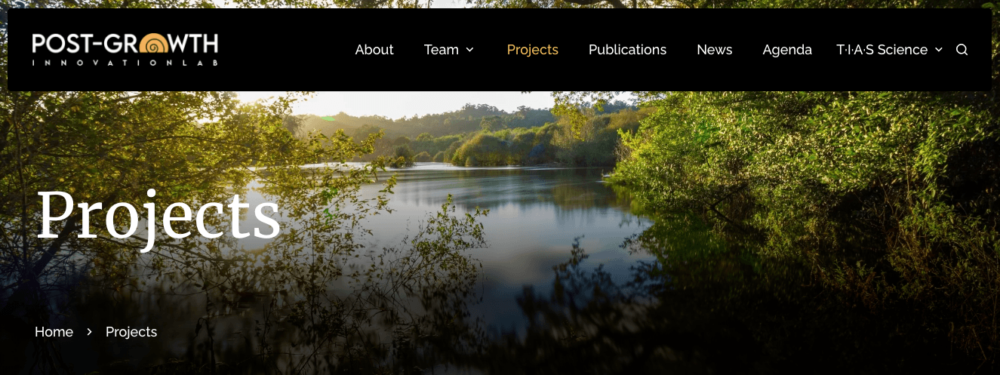
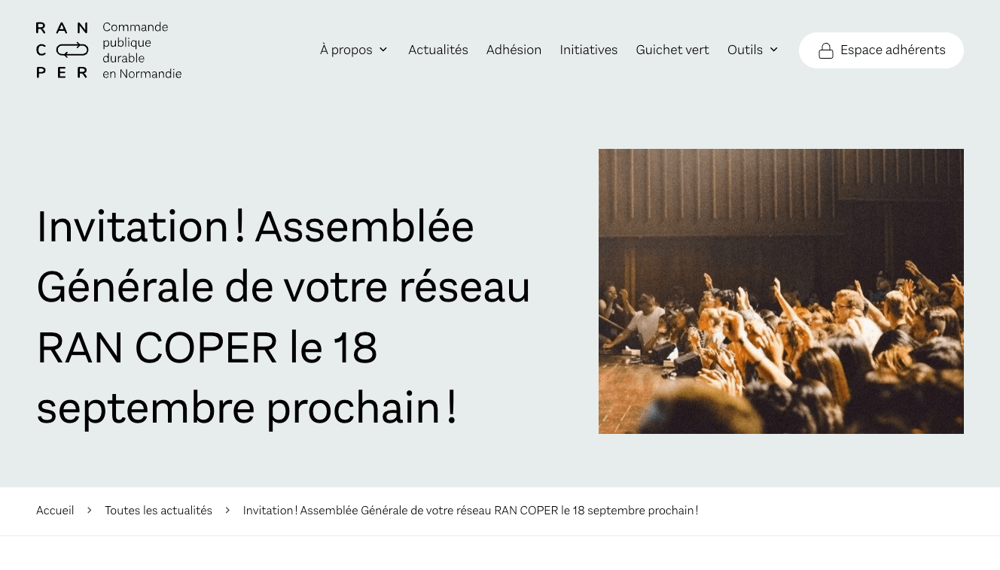

## Menu

Le menu permet de gérer l'affichage des éléments qui sont imbriqués à l'intérieur : faut-il afficher le titre d'un dropdown en grand ? Son résumé ? Le résumé de ses enfants ? etc.

```yaml
menu:
  primary:
    level_1:
      dropdown: true
      summary:
        active: false
        source: "Summary" # "Summary" | "meta_description"
        truncate: 125
    level_2:
      dropdown: false
      summary:
        active: false
        source: "Summary" # "Summary" | "meta_description"
        truncate: 125
      title:
        active: false
        summary:
          active: false
          source: "Summary" # "Summary" | "meta_description"
          truncate: 125
    level_3:
      dropdown: false
      summary:
        active: false
        source: "Summary" # "Summary" | "meta_description"
        truncate: 125
```

<details>
<summary>
Exemples de dropdown sans titre
</summary>
Sans description :


→ Voir [communication-publique.fr/](https://www.communication-publique.fr/)

Avec description de niveau 1 :

→ Voir [cityorchestra.metropole.rennes.fr](https://cityorchestra.metropole.rennes.fr/)
</details>

<details>
<summary>
Exemples avec un titre de niveau 2
</summary>

Sans résumé :

→ Voir [la-criee.org](https://www.la-criee.org/fr/)

Avec résumé :

→ Voir [mids.ch](https://mids.ch/)
</details>

## Fil d'Ariane

La position du fil d'Ariane se paramètre via une clef :

```yaml
breadcrumb:
  position: hero-start # hero-start | hero-end | after-hero | after-hero-title | none
```

<details>
<summary>
Aperçu
</summary>

Affichage `hero-start` (défaut) :

→ Voir [cityorchestra.metropole.rennes.fr](https://cityorchestra.metropole.rennes.fr/usages/adaptation-changement-climatique/)

Affichage `after-hero-title` :

→ Voir [frenchcraftguild.fr](https://www.frenchcraftguild.fr/fr/actualites/2026-02-13-prototype-une-premiere-edition-reussie/)

Affichage `hero-end` :

→ Voir [postgrowth-lab.uvigo.es](https://postgrowth-lab.uvigo.es/projects/)

Affichage `after-hero` :

→ Voir [ran-coper.fr](https://ran-coper.fr/toutes-les-actualites/2026-07-09-invitation-assemblee-generale-de-votre-reseau-ran-coper-le-18-septembre-prochain/)
</details>

### Accessibilité

Suite à l'audit réalisé par Ideance sur le site de la Métropole de Rennes (Mai 2025), le fil d'Ariane en mobile a désormais une option `extendable` qui permet de réduire le breadcrumb à un bouton "Voir le fil d'Ariane", qui, une fois déployé, montre en un seul bloc et sans scroll horizontal (l'option par défaut) l'intégralité du fil.

```yaml
breadcrumb:
  extendable: false
```

## Summary

Le summary peut se placer à deux endroits : dans le hero ou sous ce dernier.
La taille de son texte et son style varie en fonction de son emplacement.

```yaml
summary:
  position: hero # hero | content
```

## Recherche

La recherche est désactivée par défaut sur les sites osuny, le nombre de ses résultats (un paramètre pagefind) est modifiable, de même que sa position :

* dans le menu `primary` elle se place à la fin des liens du menu, avant les langues ;
* dans le footer elle se place à la fin du menu légal ;
* en "fixe" elle reste fixée en bas à gauche de l'écran.

```yaml
search:
  active: false
  max_results: 20
  positions:
    - primary
    # - upper-menu
    # - fixed
    # - footer
```

> Le upper menu est un cas particulier, car il faut d'abord en paramétrer un pour y afficher la recherche, voir ["Upper menu : un sur-menu au-dessus du header"](/docs/website/configurer-le-site/sass/#upper-menu--un-sur-menu-au-dessus-du-header) dans Configuration Sass.

> Les positions sont identiques pour le menu des langues, la version fixe en moins.
