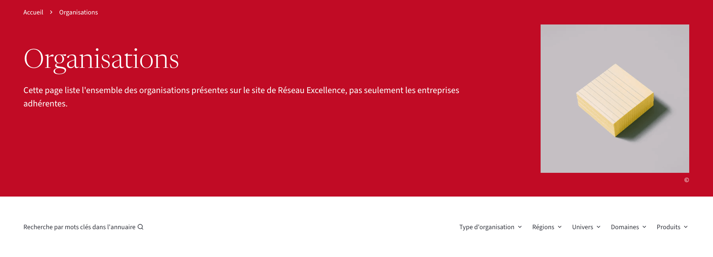
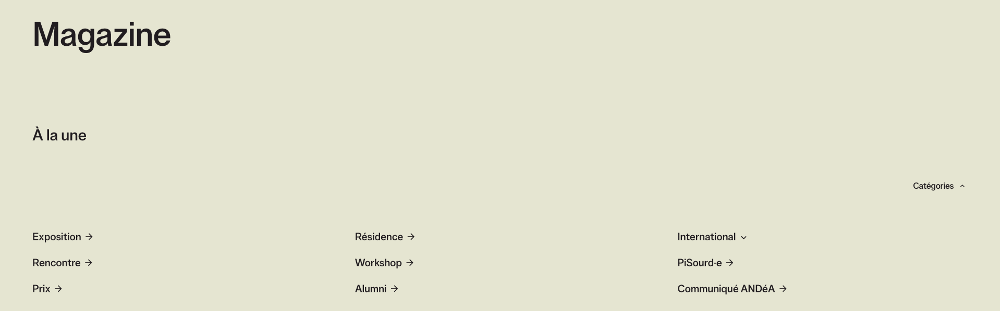
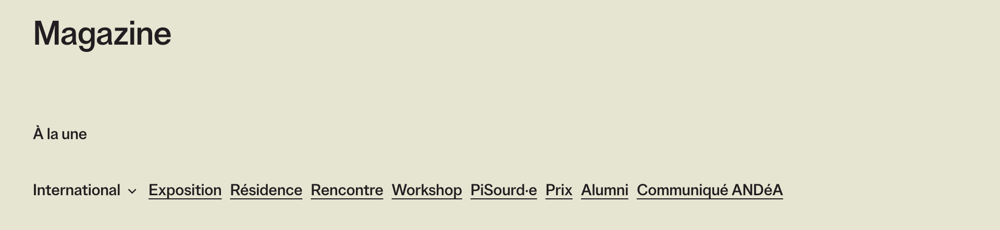
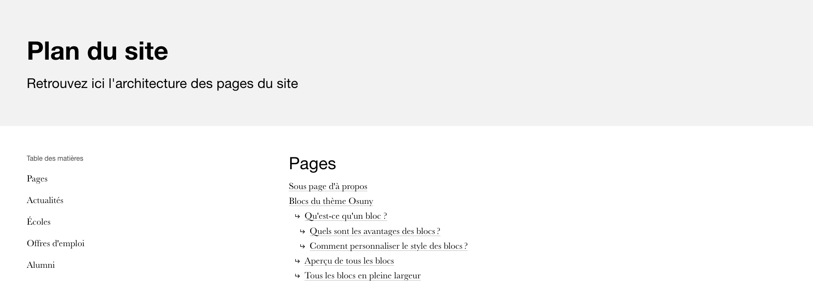
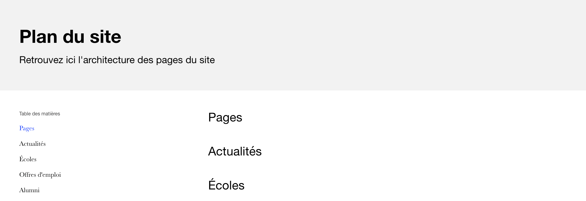
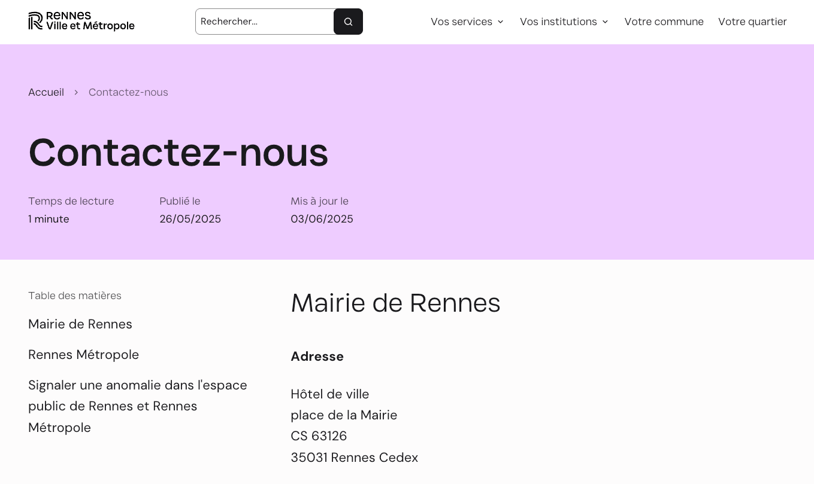
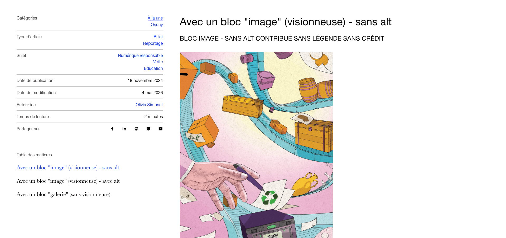
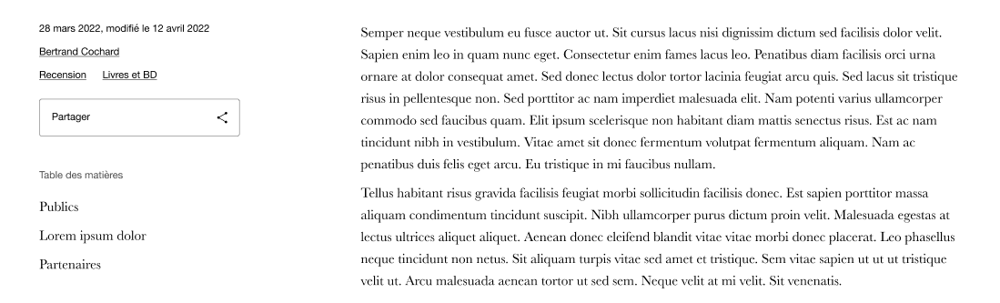

Une configuration permet de paramétrer un ensemble d'affichages de façon globale.
Une fois dupliqués dans chaque type d'objet, ils écrasent les paramètres par défaut.

```yaml
default:
  index:
    taxonomies:
      display: true
      layout: dropdown # dropdown | inline
      show_name: true
    search:
      active: false
  single:
    meta:
      position: content
      options:
        authors: false
        dates: false
        published_at: false
        reading_time: false
        share: false
        taxonomies: true
        updated_at: false
        with_labels: true
    taxonomies:
      show_name: true
  sitemap:
    ignore_children: false
```

Dans les index, `search` permet d'afficher un bouton ouvrant la recheche scopée dans un objet. 

<details>
<summary>
Aperçu
</summary>


→ Voir [reseauexcellence.fr](https://www.reseauexcellence.fr/fr/organisations/)
</details>

Les paramètres de `taxonomies` permettent de configurer l'affichage de ces dernières.

<details>
<summary>
Aperçu
</summary>

Dropdown :

→ Voir [beauxartsdemarseille.fr](https://www.beauxartsdemarseille.fr/magazine/)

Inline :

</details>

Le sitemap permet d'afficher ou non les enfants de chaque objet :
<details>
<summary>
Avec enfants
</summary>


</details>
<details>
<summary>
Sans enfant
</summary>


</details>

## Metas

Les metas désignent l'ensemble des informations relatives à un type d'objet. Cela peut être, par exemple, la date de publication d'une actualité ou l'année d'un projet. Leur affichage dépend de l'option `with_label`.

Elles s'appliquent aux actualités, aux pages, aux projets, aux personnes et aux organisations. Les événements et les expositions ont un fonctionnement distinct.

### Dans le hero

Dans une page en pleine ou en semi largeur :

<details>
<summary>
Avec labels
</summary>


→ Voir [metropole.rennes.fr](https://metropole.rennes.fr/contactez-nous/)
</details>

<details>
<summary>
Sans label
</summary>


→ Voir [levelesyeux.com](https://www.levelesyeux.com/actualites/2026-04-24-technopolice/)
</details>

### Dans le corps de page

Dans une page en pleine largeur :

<details>
<summary>
Avec labels
</summary>


→ Voir [example.osuny.org](https://example.osuny.org/fr/actualites/2025-04-03-le-festin-de-pierres/)
</details>

Dans une page largeur partielle :

<details>
<summary>
Sans label
</summary>


</details>
