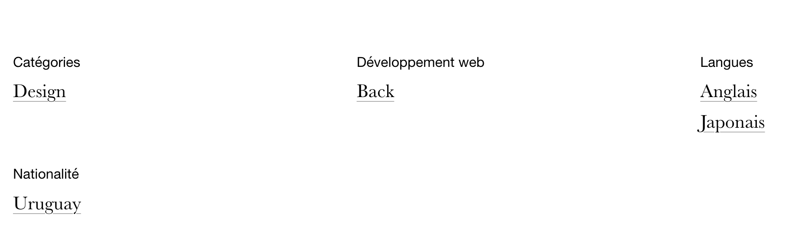

Vous pouvez configurer ces options pour chaque type de contenu (`posts`, `events`, `persons`, `organizations`...)

## Catégories

Pour masquer les taxonomies, et n'afficher que les catégories en une liste unique.

#### Options par défaut

Vous pouvez modifier les options par défaut pour modifier l'affichage de tous les types de contenu :

```yml
  default:
    single:
      taxonomies:
        display: true
```

Par exemple pour afficher ou masquer les taxonomies sur la single d'une `person`.

#### Masqué :

```yml
persons:
  single:
    taxonomies:
      display: false
```


#### Affichée (par défaut) :

```yml
persons:
  single:
    taxonomies:
      display: true
```

