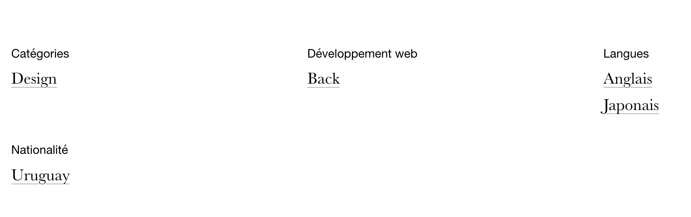
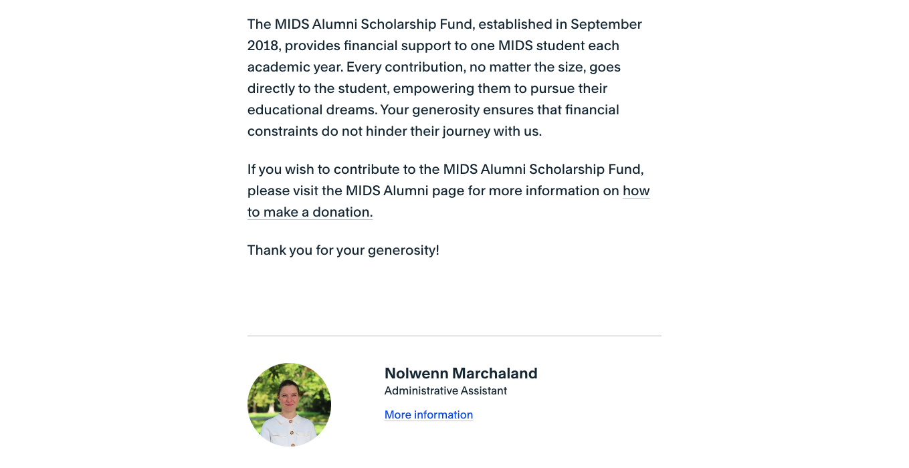
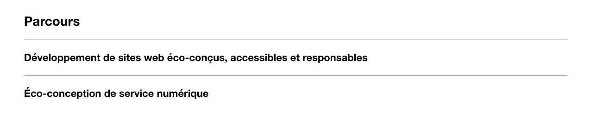
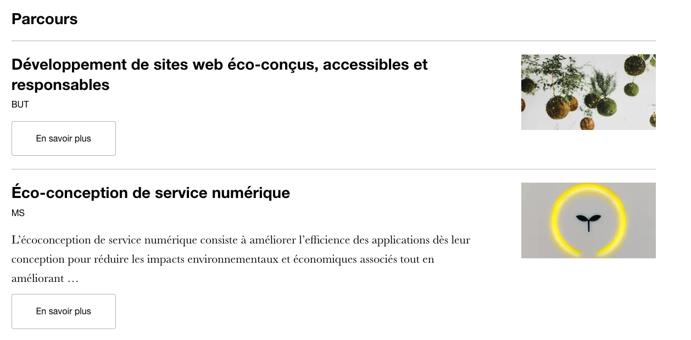
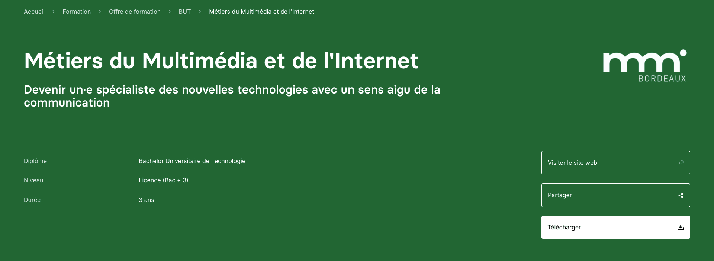

Vous pouvez configurer ces options pour chaque type de contenu (`posts`, `events`, `persons`, `organizations`...)

## Catégories

Pour masquer les taxonomies, et n'afficher que les catégories en une liste unique.

#### Options par défaut

Vous pouvez modifier les options par défaut pour modifier l'affichage de tous les types de contenu :

```yml
  default:
    single:
      taxonomies:
        display: true
```

Par exemple pour afficher ou masquer les taxonomies sur la single d'une `person`.

#### Masqué :

```yml
persons:
  single:
    taxonomies:
      display: false
```


#### Affichée (par défaut) :

```yml
persons:
  single:
    taxonomies:
      display: true
```



## Cas particuliers

### Actualités

Une configuration permet d'afficher les auteurs ou autrices d'un article en bas de celui-ci.
```yml
posts:
  single:
    ...
    options:
      signature: false
```

<details>
<summary>
Aperçu
</summary>


→ Voir [cids.ch](https://cids.ch/about/news/2024-09-25-mids-alumni-scholarship-fund/)
</details>

### Projets

Il est possible d'inverser la navigation entre les projets. Par défaut, le projet précédent est plus ancien que celui actuel, et le projet suivant plus récent.

```yml
projects:
  navigation:
    reversed: false
```

### Formations

Certaines options du single d'une formation permettent de changer l'affichage des formations enfants :

```yml
programs:
  single:
    children:
      options:
        button: false
        contact: false
        diploma: false
        diploma_certification: false
        image: false
        logo: false
        summary: false
```

<details>
<summary>
Par défaut
</summary>


</details>

<details>
<summary>
Avec toutes les options à true
</summary>


</details>

Une autre série de paramètres permettent de configurer l'entête d'une formation, mais aussi son footer (`updated_at`) :

```yml
programs:
  single:
    options:
      diploma_certification: true
      logo: true
      registration_link: false
      updated_at: true
      website_link: true
```

<details>
<summary>
Aperçu
</summary>


→ Voir [iut.u-bordeaux-montaigne.fr](https://www.iut.u-bordeaux-montaigne.fr/formation/offre-de-formation/metiers-du-multimedia-et-de-l-internet/)
</details>