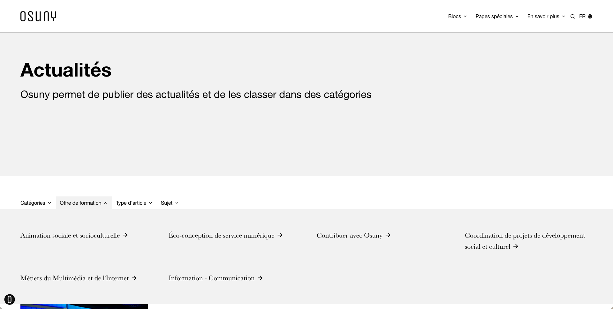
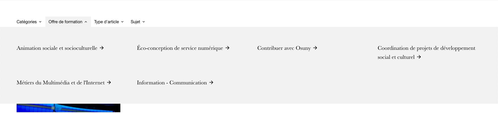

Vous pouvez configurer ces options pour chaque type de contenu (`posts`, `events`, `persons`, `organizations`...). Ou de façon global sur la clé `params.categories`.

## Les sélecteurs de catégories

Les pages d'index ont des sélecteurs de catégories triées par taxonomies.



Il est possible de conserver ces sélecteurs sur les pages des catégories.



#### Options par défaut

Vous pouvez modifier les options par défaut pour modifier l'affichage de tous les types de contenu :

```yml
params:
  categories:
    single:
      taxonomies:
        display: true
```

Par exemple pour afficher ou masquer les taxonomies sur la single d'une `person`.

#### Masqué :

```yml
params:
  persons:
    categories:
      taxonomies:
        display: true
```
