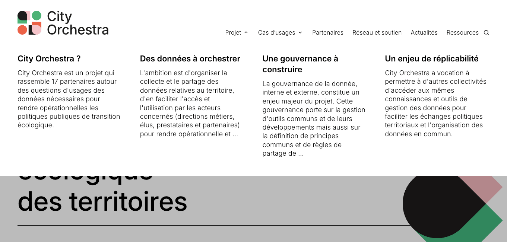
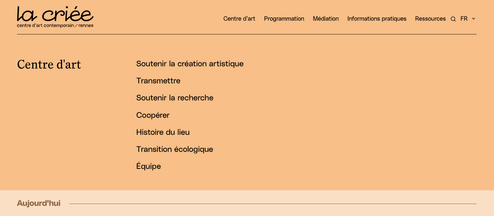
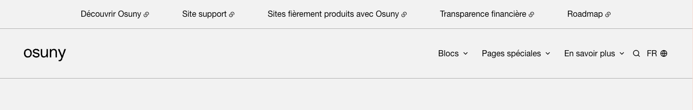
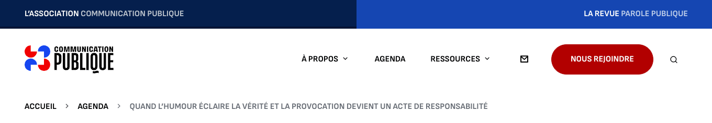
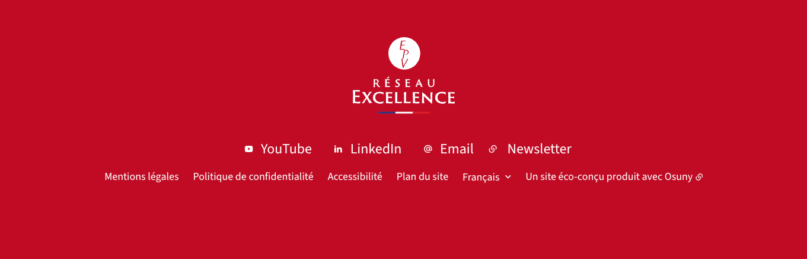
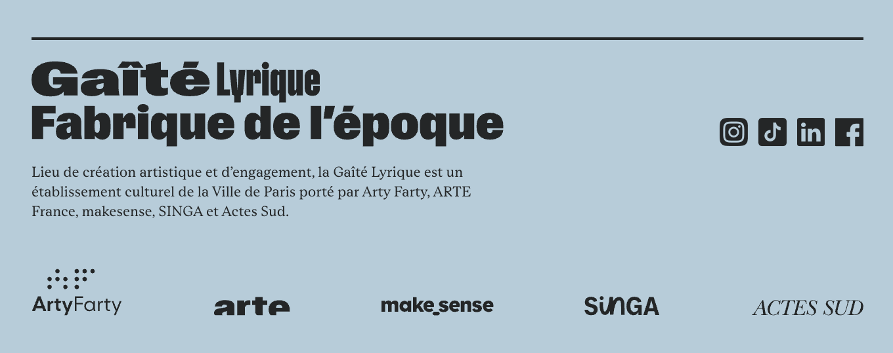

Le thème `osuny-hugo-theme-aaa` inclus dans le dossier `/themes/osuny` est un thème Hugo, de nombreuses variables SASS sont définis dans celui-ci. Il est donc possible d'utiliser ces variables pour personnaliser le site de différentes manières.
L'intégralité des variables SASS disponible à la modification ce trouve dans les fichiers constituant le dossier [assets/sass/\_theme/configuration](https://github.com/osunyorg/theme/tree/main/assets/sass/_theme/configuration) du theme.

| Nom du fichier | Impact |
|----------------|--------|
| animations     | toutes les animations du site (déplacement des flèches, couleurs au survol) |
| blocks         | layouts et style par défaut des différents blocs |
| colors         | toutes les couleurs de base du site (ex: `$color-accent`) |
| components     | couleurs, tailles, espacements des composants du système (ex: `header`, `hero`, `footer`) |
| icons          | liste de toutes les icônes du système <br>→ visibles sur [example.osuny.org](https://example.osuny.org/icones/) |
| layouts        | style propre à certains layouts (ex: couleur de fond des pages en mode cartes) |
| sections       | style spécifique aux sections Hugo (ex: `.jobs__section`), aux pages (`.jobs__page`) et à la home |
| spacings       | configuration de la grille (gouttières) et des espacements du système |
| typography     | taille, interlignage, police du système (ex: titres `hn`, meta, signatures...) <br>→ visible sur votre site en local à l'adresse `/typography` |
| zindex         | gestion des niveaux de superposition des éléments |


## Couleurs

Pour définir les couleurs principales du thème :

```sass
$color-accent: #0038FF !default
$color-text: #000000 !default
$color-text-alt: #454545 !default
$color-border: rgba(0, 0, 0, 0.30) !default
$color-background-alt: #F2F2F2 !default
$color-background: #FFFFFF !default
```

Pour définir la couleur du texte général et la couleur de fond du site :

```sass
$body-color: $main-color !default
$body-background-color: $main-background-color !default
```

Pour définir l'apparence des liens (couleur et espace entre le soulignement et le lien) :

```sass
$link-color: $main-color !default
$link-underline-offset: 6px !default
```

## Typographie

### Font family

```sass
/* Fonts family */
$body-font-family: "Baskerville", "Times New Roman", "Times", serif !default
$heading-font-family: "Helvetica Neue", "Helvetica", "Arial", sans-serif !default
```

### Font size, weight et height

#### Font sizes

```sass

/* Générales */
$body-size-desktop: px2rem(22) !default
$body-size: px2rem(18) !default

/* Lead */
$lead-size-desktop: px2rem(60) !default
$lead-size: px2rem(24) !default
$lead-sidebar-size-desktop: pxToRem(32) !default
$lead-sidebar-size: $lead-size !default
$lead-hero-size: $lead-size !default
$lead-hero-size-desktop: $lead-sidebar-size-desktop !default

/* Small */
$small-size-desktop: pxToRem(18) !default
$small-size: pxToRem(14) !default

/* Signature */
$small-size: px2rem(14) !default
$signature-size-desktop: px2rem(22) !default
$signature-size: px2rem(18) !default

/* Meta */
$meta-size-desktop: px2rem(16) !default
$meta-size: px2rem(14) !default
```

> "Small" correspond au texte de la même police que le corps de texte, mais en plus petit (ex: les notes des chapitres)

> "Signature" correspond à la police de titre et à la taille du corps de texte (ex: sous-menu dans le header, titre des définitions)

> "Meta" correspond au texte secondaire, en police plus petite (ex: les éléments du header)

> "Quote" correspond aux citations, notamment dans le bloc témoignage. On gère deux formats d'affichage avec une police plus ou moins grande selon la longueur du texte

#### Line height

```sass

/* Général */
$body-line-height: 160% !default

/* Headings */
$h1-line-height: 120 !default
$h2-line-height: 110 !default
$h3-line-height: 110 !default
$h4-line-height: 130 !default
$h5-line-height: 130% !default
$h6-line-height: 130% !default

/* Cas particuliers */
$lead-line-height: 120% !default
$lead-sidebar-line-height: $lead-line-height !default
$lead-hero-line-height: $lead-sidebar-line-height !default
$small-line-height: 130% !default
$signature-line-height: 130% !default
$meta-line-height: 150% !default
$quote-line-height: 120% !default
```

#### Font-weight

```sass
$body-weight: normal !default
```

Une variable globale permet de gérer les font-weight des titres :

```sass
$heading-font-weight: normal !default
```

Chaque titre peut ensuite être personnalisé :

```sass
$h1-weight: bold !default
$h2-weight: $heading-font-weight !default
$h3-weight: bold !default
$h4-weight: bold !default
$h5-weight: $heading-font-weight !default
$h6-weight: $heading-font-weight !default
```

De même que les autres niveaux typographiques :

```sass
/* Lead */
$lead-weight: $heading-font-weight !default
$lead-sidebar-weight: $lead-weight !default
$lead-hero-weight: $lead-sidebar-weight !default

/* Small */
$small-weight: normal !default

/* Signature */
$signature-weight: $heading-font-weight !default

/* Meta */
$meta-weight: $heading-font-weight !default

/* Quote */
$quote-weight: normal !default
```

#### Letter-spacing

Chaque niveau typographique peut être ajusté au niveau de l'espacement de ses lettres : 

```sass
/* Titres */
$h1-letter-spacing: normal !default
$h2-letter-spacing: normal !default
$h3-letter-spacing: normal !default
$h4-letter-spacing: normal !default
$h5-letter-spacing: normal !default
$h6-letter-spacing: normal !default

/* Lead */
$lead-letter-spacing: normal !default
$lead-sidebar-letter-spacing: normal !default
$lead-hero-letter-spacing: normal !default

/* Small */
$small-letter-spacing: normal !default

/* Signature */
$signature-letter-spacing: normal !default

/* Meta */
$meta-letter-spacing: normal !default

/* Quote */
$quote-letter-spacing: normal !default
```

#### Text-transform

La casse de chaque niveau d'information peut être ajustée :

```sass
/* Titres */
$h1-text-transform: normal !default
$h2-text-transform: normal !default
$h3-text-transform: normal !default
$h4-text-transform: normal !default
$h5-text-transform: uppercase !default
$h6-text-transform: uppercase !default

/* Lead */
$lead-text-transform: normal !default
$lead-sidebar-text-transform: normal !default
$lead-hero-text-transform: normal !default

/* Small */
$small-text-transform: normal !default

/* Signature */
$signature-text-transform: normal !default

/* Meta */
$meta-text-transform: none !default
```

#### Headings sizes

Le site étant codé en mobile-first, les apparences des titres sont par défaut définies pour correspondre au mobile.

##### Mobile

```sass
$h1-size: px2rem(30) !default
$h2-size: px2rem(24) !default
$h3-size: px2rem(20) !default
$h4-size: px2rem(16) !default
$h5-size: px2rem(20) !default
$h6-size: px2rem(14) !default
```

##### Desktop

```sass
$h1-size-desktop: px2rem(60) !default
$h2-size-desktop: px2rem(40) !default
$h3-size-desktop: px2rem(28) !default
$h4-size-desktop: px2rem(22) !default
$h5-size-desktop: px2rem(24) !default
$h6-size-desktop: px2rem(20) !default
```

## Grid et espacements

```sass
/* Spacing */
$space-unit: 4
$spacing-1: space(2) !default   // 8px
$spacing-2: space(3) !default   // 12px
$spacing-3: space(6) !default   // 24px
$spacing-4: space(12) !default  // 48px
$spacing-5: space(16) !default  // 64px
$spacing-6: space(32) !default  // 128px
$spacing-7: space(64) !default  // 256px

/* Grid */
$grid-gutter: 60px
$grid-max-width: 1980px
```

> La fonction `space` multiplie par `$space-unit` le nombre indiqué.

## Z-index

Utile pour la navigation accessible masquée destinée aux technologies d'assistance, ainsi que pour les liens des cards.

```sass
$zindex-nav-accessibility: 1010 !default
$zindex-stretched-link: 2 !default
```

## Éléments du design system

### Breadcrumb

Pour personnaliser l'apparence du fil d'ariane, on peut utiliser les variables suivantes :

```sass
$breadcrumb-color: $hero-color !default
$breadcrumb-color-active: $hero-color !default
$breadcrumb-icon: "arrow-right-s-line" !default
$breadcrumb-icon-color: var(--color-text-alt) !default
```

### Breakpoints

```sass
$grid-breakpoints: (xs: 0, sm: 576px, md: 768px, desktop: 992px, lg: 992px, xl: 1200px, xxl: 1440px, xxxl: 1600px) !default
```

### Header

Les couleurs du header sont personnalisables :

```sass
/* Typographies */
$header-color: $color-text !default
$header-hover-color: $color-accent !default

/* Couleurs de fond */
$header-background: transparent !default
```

L'animation du header (sticky) et des dropdowns est paramétrable :

```sass
$header-sticky-enabled: true !default
$header-border-bottom-width: var(--border-width) !default

/* Couleurs */
$header-sticky-background: $color-background !default
$header-sticky-color: $header-color !default
$header-sticky-dropdown-background: $header-sticky-background !default

/* Transitions */
$header-transition: 0.3s !default
$header-sticky-transition: $header-transition !default
$header-dropdown-transition: $header-transition !default

/* Tailles et espacements */
$header-nav-padding-y: px2rem(30) !default
$header-logo-height: 32px !default
$header-logo-height-desktop: $header-logo-height !default
$header-height: 99px !default
$header-height-desktop: 74px !default
```

> L'option header-sticky-enabled détermine si la barre de navigation restera fixée ou non au haut de l'écran en scroll.

Customisation des sous-menus :

```sass
/* Couleurs */
$header-dropdown-background: $header-background !default
$header-dropdown-color: $header-color !default

/* Transition */
$header-dropdown-transition: $header-transition !default
```

#### Affichage des dropdown du header

Il est possible de choisir entre 2 affichages du menu déplié : en dropdown sous l'élément cliqué ou en pleine largeur. Dans le dropdown, les liens sont en liste, les uns au-dessus des autres, en pleine largeur ils sont répartis en colonne.

```sass
$header-dropdown-full: false !default
```

<details>
<summary>
Aperçu
</summary>

Dropdown normaux :

→ Voir [futurs-lejeu.fr](https://www.futurs-lejeu.fr/fr/)

Dropdown pleine largeur :

→ Voir [cityorchestra.metropole.rennes.fr](https://cityorchestra.metropole.rennes.fr/)
</details>

Une variable permet de changer automatiquement la couleur du logo du site lorsque le header devient fixe :

```sass
$header-sticky-invert-logo: false !default
```

Si l'option `site.Params.menu.level_2.title` (config hugo) est activée, un titre (et potentiellement un résumé) s'affichent sous l'item sélectionné dans le header. L'apparence de ce titre se paramètre également :

```sass
$header-dropdown-title-summary-font-family: $lead-hero-font-family !default
$header-dropdown-title-summary-font-size: $body-size !default
$header-dropdown-title-summary-font-size-desktop: $lead-hero-size-desktop !default
$header-dropdown-title-summary-line-height: 120% !default
$header-dropdown-title-summary-line-height-desktop: $header-dropdown-title-summary-line-height !default
```

<details>
<summary>
Aperçu
</summary>

Sans résumé :

→ Voir [la-criee.org](https://www.la-criee.org/fr/)

Avec résumé :

→ Voir [mids.ch](https://mids.ch/)
</details>

#### Upper menu : un sur-menu au-dessus du header

Donner le nom `upper-menu` à un des menus de l'admin permet d'afficher ce dernier au-dessus du menu principal. Ça permet de mettre en valeur des liens internes ou externes.

```sass
$header-upper-menu-background: $header-background !default
$header-upper-menu-color: $header-color !default
```

Le upper menu possède les même propriétés que le header :

```sass
$header-upper-menu-sticky-background: $header-sticky-background !default
$header-upper-menu-sticky-color: $header-sticky-color !default
$header-upper-menu-border-bottom-width: $header-border-bottom-width !default
$header-upper-menu-padding-y: $header-nav-padding-y !default
$header-upper-menu-padding-y-desktop: $header-upper-menu-padding-y !default
$header-upper-menu-mobile-height: pxToRem(50) !default
```

Le upper menu intègre l'affichage d'un item actif (une bordure en bas) lorsque l'on est sur la page du lien :

```sass
$header-upper-menu-active-decoration-color: var(--color-border) !default
$header-upper-menu-active-decoration-height: 4px !default
```

Dans le cas d'un écosystème de site, par exemple, cette variable permet de mettre la class `active` sur les liens externes plutôt que le lien courrant :

```sass
$header-upper-menu-active-style-for-sites: false !default
```

<details>
<summary>
Aperçu
</summary>


→ Voir [example.osuny.org](https://example.osuny.org/fr/)


→ Voir [communication-publique.fr](https://www.communication-publique.fr/)
</details>

### Footer

```sass
/* Couleurs */
$footer-color: $color-text !default
$footer-background-color: $color-background-alt !default

/* Affichage du logo */
$footer-logo-height: $header-logo-height !default
$footer-logo-height-desktop: $footer-logo-height !default
```

Il est possible de configurer l'affichage des icônes de réseaux sociaux dans le footer (avec ou sans texte) :

```sass
$footer-icons-enabled: true !default
$footer-icons-size: pxToRem(20) !default
$footer-icons-size-desktop: pxToRem(16) !default
$footer-text-hidden: false !default
```

<details>
<summary>
Aperçu
</summary>


→ Voir [reseauexcellence.fr](https://www.reseauexcellence.fr/fr/)


→ Voir [gaite-lyrique.net](https://www.gaite-lyrique.net/)
</details>

### Hero

```sass
$hero-height: 300px !default
$hero-height-desktop: 400px !default
$hero-color: $color-text !default
$hero-background-color: $color-background-alt !default
```

Par souci d'accessibilité, il est possible d'ajuster la couleur des crédits sous l'image du hero :
```sass
$hero-credit-color: var(--color-text-alt) !default
$hero-credit-color-desktop: $hero-credit-color !default
```

### Icons

```sass
$icons: ()
$icons: map-merge($icons, ("arrow": "\e905"))
$icons: map-merge($icons, ("arrow-first": "\e906"))
$icons: map-merge($icons, ("arrow-last": "\e907"))
$icons: map-merge($icons, ("arrow-left": "\e908"))
$icons: map-merge($icons, ("arrow-right": "\e909"))
$icons: map-merge($icons, ("burger": "\e902"))
$icons: map-merge($icons, ("caret": "\e904"))
$icons: map-merge($icons, ("caret-bottom": "\e911"))
$icons: map-merge($icons, ("caret-left": "\e912"))
$icons: map-merge($icons, ("caret-right": "\e913"))
$icons: map-merge($icons, ("caret-top": "\e914"))
$icons: map-merge($icons, ("close": "\e90e"))
$icons: map-merge($icons, ("download": "\e900"))
$icons: map-merge($icons, ("eye": "\e901"))
$icons: map-merge($icons, ("link-blank": "\e903"))
$icons: map-merge($icons, ("play": "\e910"))
$icons: map-merge($icons, ("pause": "\e90f"))
$icons: map-merge($icons, ("social": "\e915"))
$icons: map-merge($icons, ("instagram": "\e90a"))
$icons: map-merge($icons, ("facebook": "\e90b"))
$icons: map-merge($icons, ("linkedin": "\e90c"))
$icons: map-merge($icons, ("twitter": "\e90d"))
```

### Navigation

Définition du background de l'overlay qui apparaît lorsque les dropdowns du menu sont activés ou que le menu est développé en mobile :

```sass
$body-overlay-color: rgba(0, 0, 0, 0.3) !default
```

### Bouttons

Les bouttons ont un style par défaut, puis deux styles distincts en fonction de la taille de deux variantes (`large` et `small`).

La typographie des boutons est personnalisable :

```sass
$btn-font-family: $heading-font-family !default
$btn-font-size: $meta-size !default
$btn-font-size-desktop: $meta-size-desktop !default
$btn-font-style: normal !default
$btn-font-weight: normal !default
$btn-line-height: $body-line-height !default
$btn-text-transform: none !default
```

Mais aussi ses couleurs :

```sass
$btn-color: var(--color-text) !default
$btn-hover-color: var(--color-text) !default
$btn-background: transparent !default
$btn-hover-background: var(--color-background) !default
```

Des détails comme ses bordures :

```sass
$btn-border-width: 1px !default
$btn-border: $btn-border-width solid var(--color-border) !default
$btn-hover-border: $btn-border !default
$btn-border-desktop: $btn-border !default
$btn-border-radius: pxToRem(4) !default
$btn-border-radius-desktop: $btn-border-radius !default
```

Leurs espacements :

```sass
$btn-padding: pxToRem(12) pxToRem(10) !default
$btn-padding-desktop: pxToRem(18) pxToRem(16) !default
```

Par défaut, les boutons ont une largeur minimale, qui peut être overridée :
```sass
$btn-min-width: pxToRem(100) !default
$btn-min-width-desktop: pxToRem(190) !default
```

La class `disabled` ajoute aussi un style propre :

```sass
$btn-disabled-color: var(--color-text-alt) !default
$btn-disabled-background: var(--color-background-alt) !default
$btn-disabled-border: $btn-disabled-background !default
```

#### `Large` et `small``

Les deux variantes du boutton par défaut changent la typographie et les espacements :

```sass
$btn-small-font-size: $btn-font-size !default
$btn-small-font-size-desktop: $btn-font-size-desktop !default
$btn-small-line-height: $btn-line-height !default
$btn-small-padding: pxToRem(6) pxToRem(10) !default
$btn-small-padding-desktop: pxToRem(6) pxToRem(10) !default
```

```sass
$btn-large-font-size: $btn-font-size !default
$btn-large-font-size-desktop: $btn-font-size-desktop !default
$btn-large-line-height: $btn-line-height !default
$btn-large-padding: pxToRem(14) pxToRem(12) !default
$btn-large-padding-desktop: pxToRem(20) pxToRem(18) !default
```

#### Bouton `accent` et `alt`

Deux mixin permettent encore de changer le style d'un bouton : `button-accent` et `button-alt`. Ils remplacent la valeur des variables css définies par la configuration par défaut.

```sass
@mixin button-accent
  @include button
  --btn-color: #{$color-background}
  --btn-background: #{$color-accent}
  --btn-border: #{$btn-border-width} solid var(--btn-background)
  --btn-hover-color: #{$color-background}
  --btn-hover-background: #{alphaColor($color-accent, 0.85)}
  --btn-hover-border: #{$btn-border-width} solid var(--btn-hover-background)
```

```sass
@mixin button-alt
  @include button
  --btn-color: #{$color-background}
  --btn-background: #{$color-text-alt}
  --btn-border: #{$btn-border-width} solid var(--btn-background)
  --btn-hover-color: #{$color-background}
  --btn-hover-background: #{$color-text}
  --btn-hover-border: #{$btn-border-width} solid var(--btn-hover-background)
```
### Table of content

#### Couleurs

```sass
$toc-color: $color-text !default
$toc-active-color: $color-accent !default
$toc-background-color: $color-background-alt !default
```

#### Typographies

##### Liens simples

```sass
$toc-font-family: $body-font-family !default
$toc-font-size: $body-size !default
$toc-font-size-desktop: $body-size-desktop !default
$toc-line-height: $body-line-height !default
```

##### Titre du TOC

```sass
$toc-title-font-family: $meta-font-family !default
$toc-title-font-size: $meta-size !default
$toc-title-font-size-desktop: $meta-size-desktop !default
```

#### Offcanvas

La hauteur de la bordure de la toc lorsqu'elle est dépliée en offcanvas est configurable :

```sass
$toc-border-width: 1px !default
```

### Tableaux

Pour personnaliser l'apparence des typographies utilisées dans les tableaux de données :

```sass
$table-head-font-size: $h4-size !default
$table-head-font-size-desktop: $h4-size-desktop !default
$table-body-size: $body-size !default
$table-body-size-desktop: $body-size-desktop !default
```

## Blocks

### Chapter

Le bloc chapitre se décline en trois mises en page : sans fond, avec un fond discret, avec un fond accentué.

Les couleurs sont configurables pour ces deux derniers layouts :

```sass
$block-chapter-layout-accent-background: var(--color-accent) !default
$block-chapter-layout-accent-color: var(--color-background) !default
$block-chapter-layout-alt-background: var(--color-background-alt) !default
$block-chapter-layout-alt-color: var(--color-text) !default
```

### Call to action

Le bloc appel à actions se décline en deux mises en page : celle avec un fond accentué, et celle simple.
Deux sets de variables sont donc disponibles :

```sass
$block-call-to-action-color: var(--color-text) !default

/* Apparence du bouton du premier lien */
$block-call-to-action-button-background: var(--color-text) !default
$block-call-to-action-button-border: var(--border-width) solid $block-call-to-action-button-background !default
$block-call-to-action-button-color: var(--color-background) !default
$block-call-to-action-button-hover-background: var(--color-text-alt) !default
$block-call-to-action-button-hover-border: var(--border-width) solid $block-call-to-action-button-hover-background !default
$block-call-to-action-button-hover-color: var(--color-background) !default
```

```sass
/* Apparence du bloc */
$block-call-to-action-accent-background: var(--color-accent) !default
$block-call-to-action-accent-color: var(--color-background) !default

/* Apparence du bouton du premier lien */
$block-call-to-action-accent-button-background: var(--color-background) !default
$block-call-to-action-accent-button-border: var(--border-width) solid $block-call-to-action-accent-button-background !default
$block-call-to-action-accent-button-color: var(--color-text) !default
$block-call-to-action-accent-button-hover-background: var(--color-text-alt) !default
$block-call-to-action-accent-button-hover-border: var(--border-width) solid $block-call-to-action-accent-button-hover-background !default
$block-call-to-action-accent-button-hover-color: var(--color-background) !default
```

Par défaut, les cta suivant le bouton sont représentés comme des liens, cette variable permet de le changer et de n'afficher que des boutons :

```sass
$block-call-to-action-all-actions-as-buttons: false !default
```

### Definitions

```sass
/* Bordure inférieure de la définition */
$block-definition-border-color: $color-border !default
$block-definition-border-color-hovered: $color-accent !default

/* Typographie */
$block-definition-color-hovered: $color-accent !default
$block-definition-font-size: $body-size !default
$block-definition-font-size-desktop: $body-size-desktop !default
```

### Key figures

La configuration de ce bloc permet d'ajuster les détails typograhiques :

```sass
$block-key_figures-number-font-family: $heading-font-family !default
$block-key_figures-unit-font-weight: normal !default
$block-key_figures-number-font-weight: bold !default
```

Mais aussi la taille des images :

```sass
$block-key_figures-image-max-width-desktop: pxToRem(128) !default
$block-key_figures-image-max-width: pxToRem(60) !default
$block-key_figures-png-max-width-desktop: pxToRem(60) !default
$block-key_figures-png-max-width: pxToRem(60) !default
```

La taille de la police de ce bloc est personnalisable pour plusieurs breakpoints, pour les chiffres (`block-key_figures-number-font-size`) et leur légende (`block-key_figures-font-size`) :

```sass
$block-key_figures-font-size-desktop: pxToRem(18) !default
$block-key_figures-number-font-size-desktop: pxToRem(40) !default

$block-key_figures-font-size-lg: pxToRem(20) !default
$block-key_figures-number-font-size-lg: pxToRem(50) !default

$block-key_figures-font-size-xl: $block-key_figures-font-size-lg !default
$block-key_figures-number-font-size-xl: pxToRem(60) !default

$block-key_figures-font-size-xxl: $block-key_figures-font-size-xl !default
$block-key_figures-number-font-size-xxl: pxToRem(80) !default

$block-key_figures-font-size: $block-key_figures-font-size-lg !default
$block-key_figures-number-font-size: $block-key_figures-number-font-size-lg !default
```

### Gallery

La couleur de fond de la galerie est personnalisable :

```sass
$block-gallery-carousel-background: $color-background-alt
```

Ainsi que la hauteur de ses images :

```sass
$block-gallery-carousel-height: 350px !default
$block-gallery-carousel-height-desktop: calc(60 * var(--rvh)) !default
```

### Image

Pour personnaliser la largeur maximale d'une image, dans le cas des pages avec ou sans sidebar :

```sass
$block-image-max-height-with-sidebar: calc(100vh - var(--header-height)) !default
$block-image-max-height-without-sidebar: none !default
```

### Pages

Seul le layout cards est personnalisable :

```sass
/* Fond du bloc */
$block-pages-card-background: var(--color-background-alt) !default

/* Apparence des cartes */
$block-pages-card-page-background: var(--color-background) !default
$block-pages-card-page-color: var(--color-text) !default
$block-pages-card-page-background-hover: var(--color-accent) !default
$block-pages-card-page-color-hover: var(--color-background) !default
```

## Posts

La grille des actualités est configurable :

```sass
$block-posts-grid-columns: 3 !default
```

## Programs

La taille des images est configurable :

```sass
$block-programs-aspect-ratio: 16/9 !default
````

### Testimonials

Paramètres par défaut :

```sass
/* Typographies */
$block-testimonials-color: $color-accent !default
$block-testimonials-font-family: $quote-font-family !default
$block-testimonials-font-size: $quote-size !default
$block-testimonials-line-height: $quote-line-height !default
$block-testimonials-style: $quote-style !default

/* Couleurs */
$block-testimonials-pagination-background: $color-border !default
$block-testimonials-pagination-progress-background: $color-accent !default
```

Pour les grands écrans :

```sass
$block-testimonials-xl-font-size: $quote-size-desktop-short !default
$block-testimonials-xl-line-height: $quote-line-height !default
$block-testimonials-xl-font-size-long-text: $quote-size-desktop-long !default
$block-testimonials-xl-line-height-long-text: $quote-line-height !default
```

### Timeline

Le fond et les couleurs de la frise chronologique sont remplaçables, de même que la bordure et les puces :

```sass
$block-timeline-horizontal-background: var(--color-background-alt) !default
$block-timeline-horizontal-color: var(--color-text) !default
$block-timeline-bullet-width: 9px !default
$block-timeline-border-width: var(--border-width) !default
```

###

Dans le cas d'un bloc titre avec la mise en page rétractée, la bordure inférieure de la zone cliquable est configurable :

```sass
$block-title-border-bottom: var(--border-width) solid var(--color-border)
```

### Layout "cards"

Le layout cartes possède des variables spécifiques par souci d'uniformisation :

```sass
$layout-cards-item-background: var(--color-background-alt) !default
$layout-cards-item-color: var(--color-text) !default
$layout-cards-item-background-hover: var(--color-accent) !default
$layout-cards-item-color-hover: var(--color-background) !default
```

## Sections

### Posts

Si la section des actualités est en layout "grid", alors la grille est personnalisable :

```sass
$posts-grid-columns: $block-posts-grid-columns !default
```

### Articles

```sass
$article-media-aspect-ratio: 16 / 9 !default
```

### Person

Personnalisation de la couleur de fond des ronds qui remplacent les photo d'une personne lorsqu'il n'y en a pas :

```sass
$persons-avatar-background-color: var(--color-background-alt) !default
```

### Organization

Pour le même objectif que pour les personnes, on utilise cette fois une variable sass plutôt que css afin de ne pas avoir de logo sombre en dark mode.

```sass
$organization-background-color: $color-background-alt !default
```

### Program

Font-size du cadre `.essential` :

```sass
$program-essential-font-size: $meta-size !default
$program-essential-font-size-desktop: $meta-size-desktop !default
```

## Taxonomies

On peut choisir d'afficher le dropdown des catégories en pleine largeur ou directement en-dessous de leur taxonomie :

```sass
$section-taxonomies-full-width: true !default
```

## MISC

### Animations

```sass
/* Animations */
$arrow-ease-transition: cubic-bezier(0, 0.65, 0.4, 1.2) !default
$arrow-ease-transition-2: cubic-bezier(0, 0.65, 0.4, 1) !default

/* Transition duration */
$default-duration: 0.25s !default
$opacity-duration: $default-duration !default
$color-duration: $default-duration !default
$background-duration: $default-duration !default
$arrow-duration: 0.55s !default
$button-duration: $default-duration !default
$menu-link-duration: $default-duration !default
```
