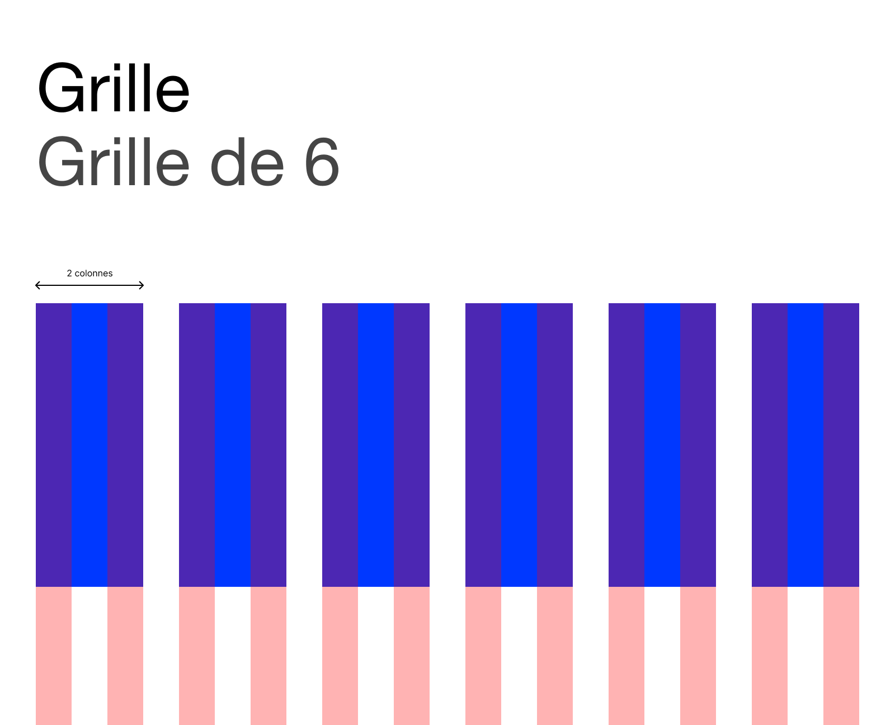
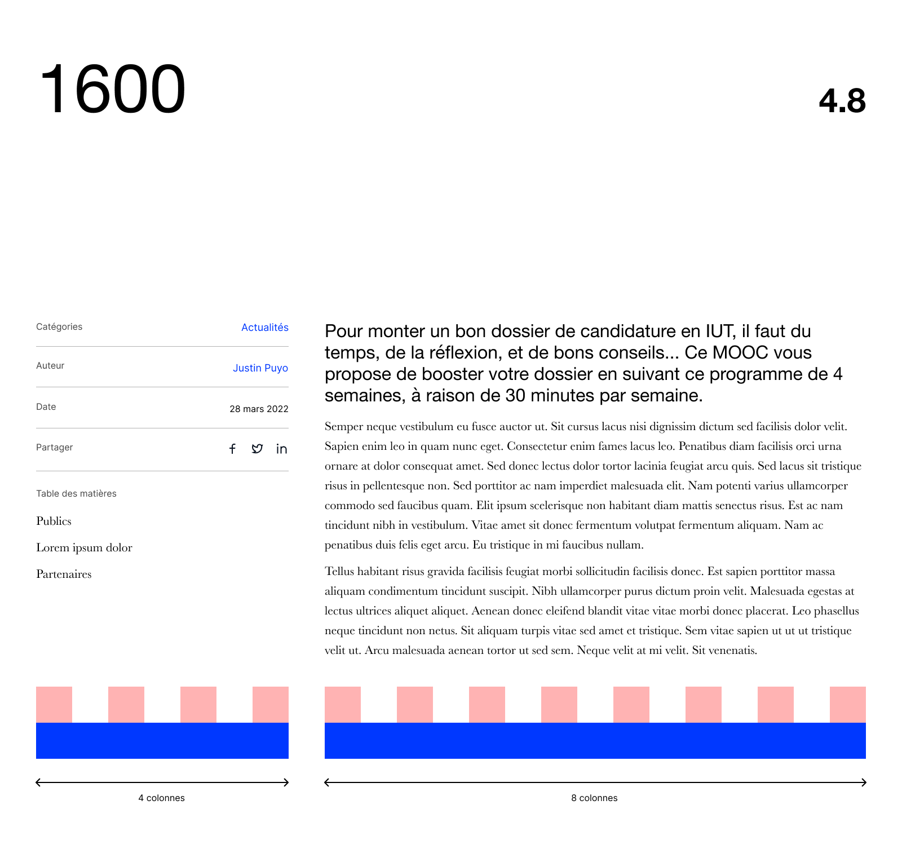
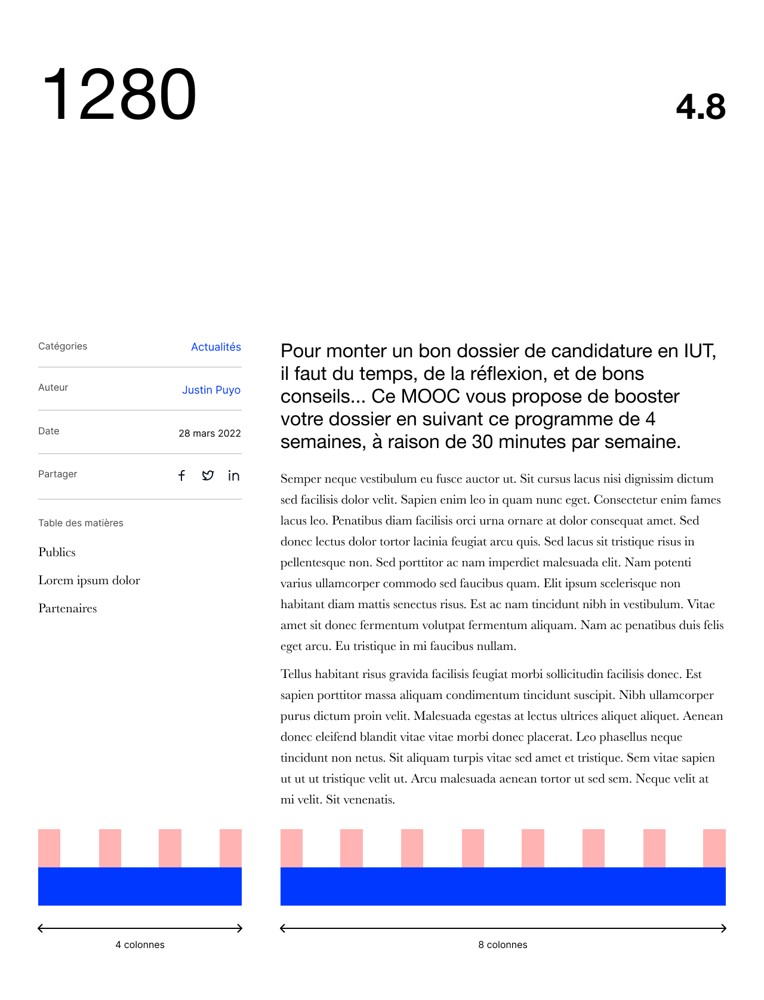

## En bref

Les grilles sont composées de 2 entités, la colonne et la gouttière.
Les colonnes sont les objets sur lesquels on aligne les contenus, et les gouttières sont les marges entre les colonnes.
La grille sur laquelle nous nous appuyons est constituée de 12 colonnes, comme Bootstrap (mais nous n'utilisons pas Bootstrap !). 

## Confusion sémantique

Quand on parle de 4 colonnes, cela peut signifier 2 choses.

### Combien d'objets ?
Que l'on met 4 objets côte à côte, ce qui fait visuellement 4 colonnes, mais composées de 3 colonnes (oui, c'est bizarre dit comme ça).


### ... ou combien de colonnes ?
Que l'on utilise 4 des 12 colonnes, ce qui fait 3 objets côte à côte.


## Grilles et colonnes

Il faut 2 mots différents, sinon c'est très confus. 
Dans Osuny, grille est utilisé pour la mise en page globale, colonnes pour le nombre de colonnes à utiliser pour s'aligner, localement.

### Grille
Une grille `grid` de 4, ça veut dire 4 objets.


Une grille de 3, ça veut dire 3 objets de 4 colonnes.


Une grille de 2, ça veut dire 2 objets de 6 colonnes.


Une grille de 6, ça veut dire 6 objets de 2 colonnes.


### Colonnes

Inversement, 4 colonnes `columns(4)` pour un objet, ça veut dire une grille de 3 objets


Pour être précis, il faudrait parler d'une grille horizontale `grid-h` mais on n'utilise pas de grille verticale, donc la précision n'est pas nécessaire.

## Les grilles dans des grilles

Imaginons que l'on coupe la page en 1/3, 2/3.
En colonnes, ça fait 4/12, 8/12.



```sass {filename="sass"}
@include media-breakpoint-up(desktop)
  .post
    &__infos
      @include columns(4)
    &__body
      @include columns(8)
```

Imaginons que l'on veuille refaire un découpage dans la partie de droite.
Imaginons que l'on veuille de nouveau la couper en 2, par exemple pour afficher 2 vignettes.
Graphiquement, on souhaite s'aligner sur les 12 colonnes, ce qui fait que chaque vignette mesure 4 colonnes de large (4+4 = 8).

.png)

```sass {filename="sass"}
@include media-breakpoint-up(desktop)
  .post
    &__infos
      @include columns(4)
    &__body
      @include columns(8)
      .page
        @include columns(4)
```

Et si l'on veut découper la partie de droite en 4 en restant alignés, ça veut dire 2 colonnes pour chaque objet.

.png)

```sass {filename="sass"}
@include media-breakpoint-up(desktop)
  .post
    &__infos
      @include columns(4)
    &__body
      @include columns(8)
      .organization
        @include columns(2)
```

En 1280 de large, la logique est exactement la même, mais la taille de chaque colonne est plus petite.


.png)
.png)

## Références

- [The Grid System: Importance of a Solid UX/UI Layout - Design lab](https://designlab.com/blog/grid-systems-history-ux-ui-layout)
- [UI Grids – All You Need to Know - UXPin](https://www.uxpin.com/studio/blog/ui-grids-how-to-guide/)
- [Building Better UI Designs With Layout Grids - Smash](https://www.smashingmagazine.com/2017/12/building-better-ui-designs-layout-grids/)
- [Using Grids in Interface Designs - Nielsen](https://www.nngroup.com/articles/using-grids-in-interface-designs/)
- [Grid system - Bootstrap](https://getbootstrap.com/docs/5.3/layout/grid/)

Pour en savoir plus sur la façon dont les grilles sont gérées dans Osuny, voir [Gérer les grilles](/docs/theme/grille/).


