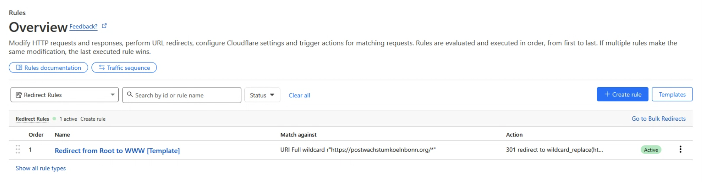

Il vous faudra paramétrer la zone DNS de votre nom de domaine pour qu'il redirige vers Deuxfleurs.
Le pointage se fait toujours vers `production.osuny.site.` (avec le point à la fin).
D'abord, créer un pointage CNAME du www vers `production.osuny.site.`.
Ensuite, faire une règle de redirection de l'apex vers www.

