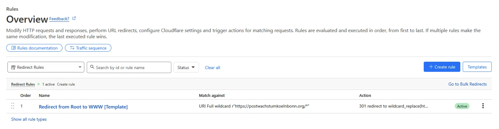

Il vous faudra paramétrer la zone DNS de votre nom de domaine pour qu'il redirige vers Deuxfleurs.

## Pointage du www

Créer un pointage CNAME du www vers `production.osuny.site.`. Noter ce pointage comme étant "DNS only", pas besoin pour Cloudflare d'interférer.

## Redirection de l'apex vers le www

Créer un pointage A de l'apex vers `192.0.2.1`, et activer le mode "Proxied" de Cloudflare (donc pas en DNS only). C'est un pointage blanc, valide pour Cloudflare, qui va permettre de gérer la redirection.

Enfin, créer une règle de redirection de l'apex vers www à partir du template fourni par Cloudflare.

