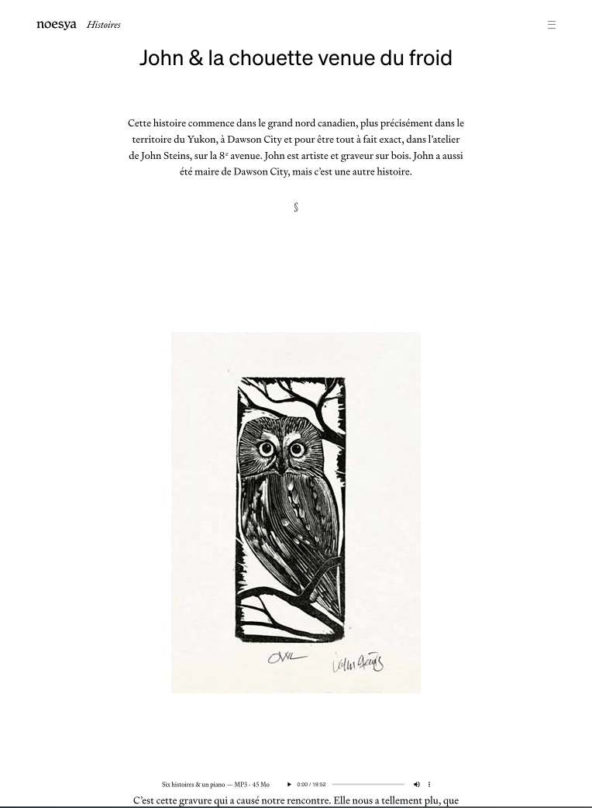
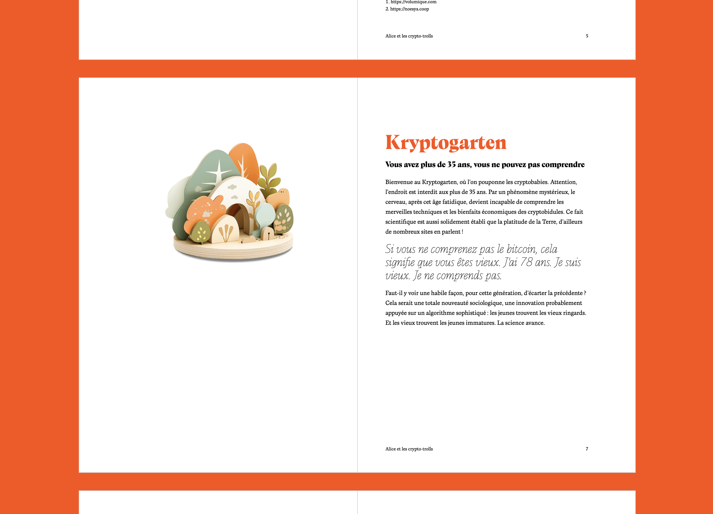
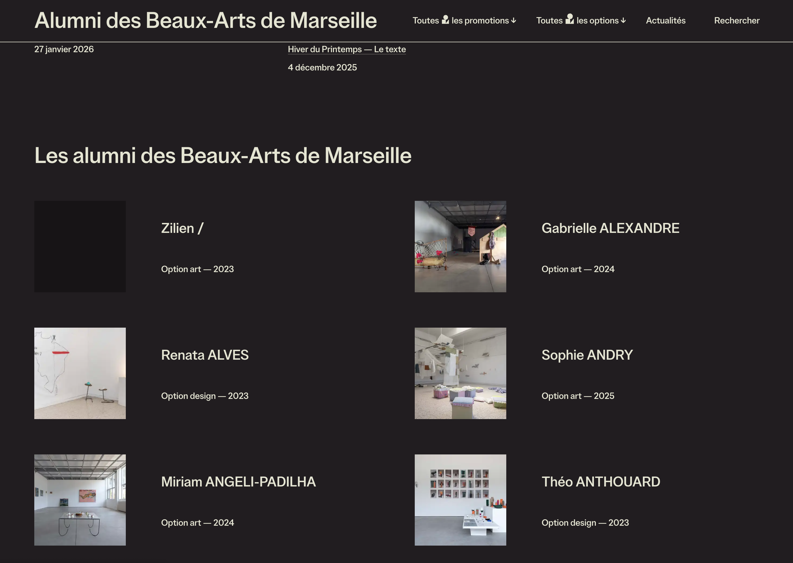

## Les styles centrés

### Header centré

[https://github.com/osunyorg/osuny-plugin-centered-header](https://github.com/osunyorg/osuny-plugin-centered-header)

### Footer centré

[https://github.com/osunyorg/osuny-plugin-centered-footer](https://github.com/osunyorg/osuny-plugin-centered-footer)

### Contenu centré

[https://github.com/osunyorg/osuny-plugin-centered-layout](https://github.com/osunyorg/osuny-plugin-centered-layout)

## Pour l'impression

[https://github.com/osunyorg/osuny-plugin-pagedjs](https://github.com/osunyorg/osuny-plugin-pagedjs)

## Composants avancés

### Indicateur de la progression de lecture

[https://github.com/osunyorg/osuny-plugin-reading-progress](https://github.com/osunyorg/osuny-plugin-reading-progress)

### Grille Masonry

[https://github.com/osunyorg/osuny-plugin-masonry](https://github.com/osunyorg/osuny-plugin-masonry)

### SPA (single page application)

[https://github.com/osunyorg/osuny-plugin-single-page-application](https://github.com/osunyorg/osuny-plugin-single-page-application)

## Université

### Site d'alumni public

[https://github.com/osunyorg/osuny-plugin-alumni-site](https://github.com/osunyorg/osuny-plugin-alumni-site)